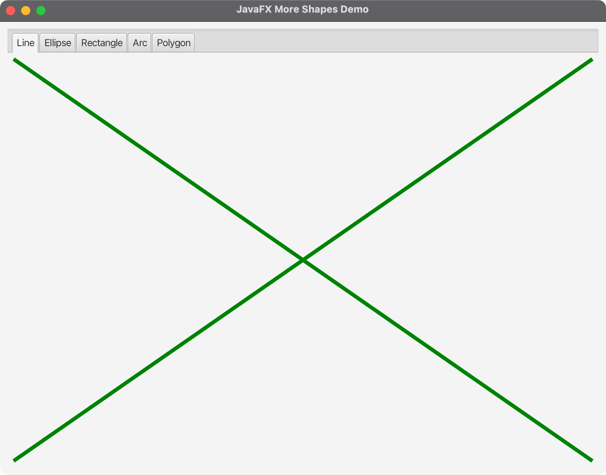
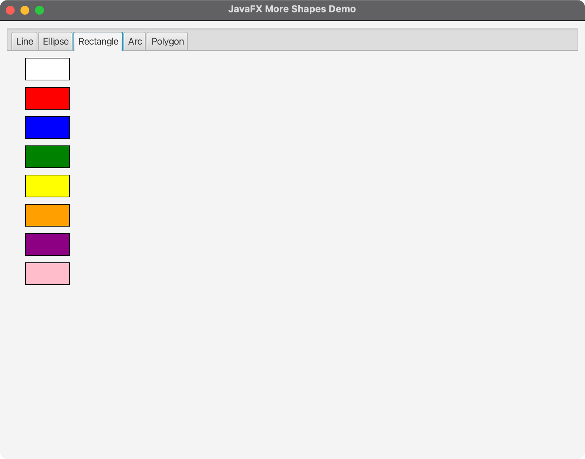
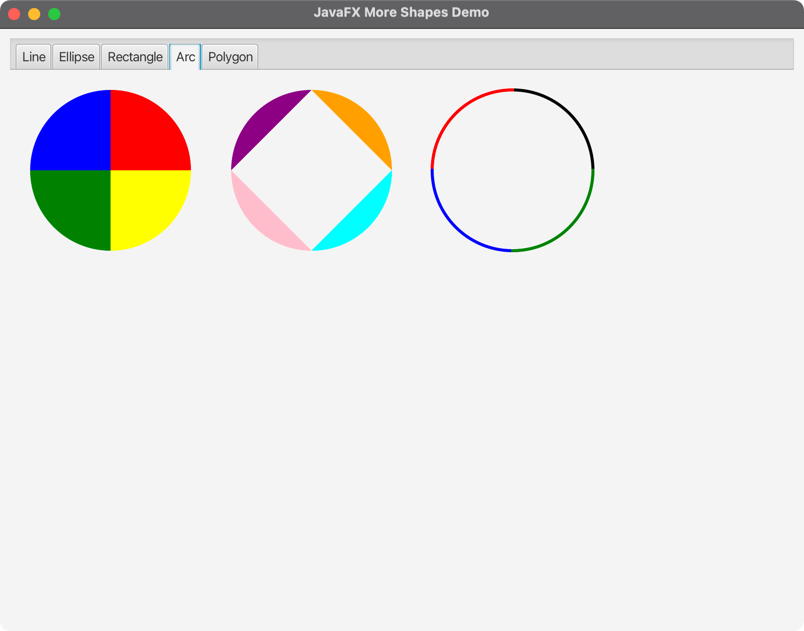
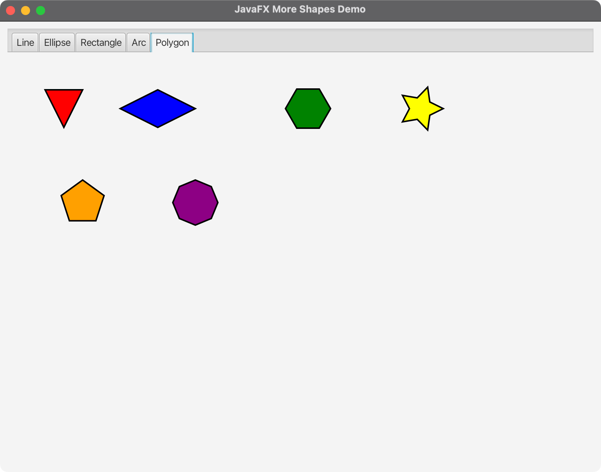

# JavaFX More Shapes Demo

A comprehensive JavaFX application that demonstrates various geometric shapes including Line, Ellipse, Rectangle, Arc, and Polygon. This project showcases the power and flexibility of JavaFX's shape rendering capabilities.

## Features

- **Line Shapes**: Demonstrates diagonal lines with dynamic resizing
- **Ellipse Shapes**: Shows multiple rotating ellipses with random colors
- **Rectangle Shapes**: Displays various rectangles with different fill colors
- **Arc Shapes**: Illustrates different arc types (ROUND, CHORD, OPEN) with various angles
- **Polygon Shapes**: Creates complex polygons including triangle, diamond, hexagon, star, pentagon, and octagon

## Technical Specifications

### Development Environment

- **Target Platform**: macOS Silicon (ARM64) - primary development environment
- **Java Version**: OpenJDK 24
- **Maven Version**: 3.9.x or later
- **JavaFX Version**: 21

### Cross-Platform Compatibility

The project is buildable and runnable on:

- **macOS**: Intel (x86_64) and Apple Silicon (ARM64)
- **Windows**: x86_64 and ARM64
- **Linux**: x86_64 and ARM64

## Project Structure

```
src/
├── main/
│   ├── java/
│   │   ├── module-info.java          # Module configuration
│   │   └── com/example/
│   │       ├── Launcher.java         # Application entry point
│   │       ├── ShapesDemo.java       # Main application class
│   │       ├── ShowLine.java         # Line shape demonstration
│   │       ├── ShowEllipse.java      # Ellipse shape demonstration
│   │       ├── ShowRectangle.java    # Rectangle shape demonstration
│   │       ├── ShowArc.java          # Arc shape demonstration
│   │       └── ShowPolygon.java      # Polygon shape demonstration
│   └── resources/
│       └── (CSS files, images, etc.)
├── test/
│   └── java/
│       └── (unit tests)
pom.xml                                # Maven build configuration
run.sh                                 # Unix/Linux/macOS execution script
run.bat                                # Windows batch execution script
run_direct.sh                          # Direct Java execution script
README.md                              # Project documentation
```

## Building and Running

### Prerequisites

1. **Java 24 or later** - Download from [Oracle](https://www.oracle.com/java/technologies/downloads/) or [OpenJDK](https://adoptium.net/)
2. **Maven 3.9.x or later** - Download from [Apache Maven](https://maven.apache.org/download.cgi/)

### Quick Start

#### Unix/Linux/macOS
```bash
# Make the script executable
chmod +x run.sh

# Run the application
./run.sh
```

#### Windows
```cmd
# Run the application
run.bat
```

#### Using Maven directly
```bash
# Clean and compile
mvn clean compile

# Run the application
mvn javafx:run
```

### Build Scripts

- **`run.sh`**: Unix/Linux/macOS execution script with dependency checks
- **`run.bat`**: Windows batch execution script with dependency checks
- **`run_direct.sh`**: Direct Java execution without Maven (requires manual JavaFX SDK setup)

## Shape Demonstrations

### Line Shapes (`ShowLine.java`)
- Creates two diagonal lines that dynamically resize with the window
- Demonstrates property binding for responsive design
- Uses green stroke with 5px width

### Ellipse Shapes (`ShowEllipse.java`)
- Generates 16 rotating ellipses with random colors
- Shows how to create complex patterns with simple shapes
- Demonstrates rotation and color generation

### Rectangle Shapes (`ShowRectangle.java`)
- Displays 8 rectangles with different fill colors
- Shows various color options available in JavaFX
- Demonstrates stroke and fill properties

### Arc Shapes (`ShowArc.java`)
- Illustrates three arc types: ROUND, CHORD, and OPEN
- Shows different angle configurations (0°, 90°, 180°, 270°)
- Demonstrates stroke and fill combinations

### Polygon Shapes (`ShowPolygon.java`)
- Creates complex geometric shapes: triangle, diamond, hexagon, star, pentagon, octagon
- Shows mathematical calculations for polygon vertices
- Demonstrates advanced shape creation techniques

## Architecture

### Design Patterns

- **Tabbed Interface**: Uses JavaFX TabPane for organized shape demonstrations
- **Responsive Design**: Shapes adapt to window resizing
- **Modular Structure**: Each shape type is implemented in its own class
- **Property Binding**: Dynamic updates based on container size changes

### Key Components

1. **ShapesDemo**: Main application class with tabbed interface
2. **Launcher**: Entry point for the application
3. **Shape Classes**: Individual demonstrations for each shape type
4. **Maven Configuration**: Cross-platform build setup with platform detection

## Cross-Platform Features

### Platform Detection
The Maven configuration automatically detects the target platform and includes the appropriate JavaFX dependencies:

- **macOS ARM64**: `mac-aarch64` classifier
- **macOS Intel**: `mac` classifier  
- **Linux x86_64**: `linux` classifier
- **Linux ARM64**: `linux-aarch64` classifier
- **Windows x86_64**: `win` classifier
- **Windows ARM64**: `win-aarch64` classifier

### Build Configuration
- Automatic platform detection via Maven profiles
- Platform-specific JavaFX dependencies
- Java 24 compilation target
- Maven Shade plugin for executable JAR creation

## Development

### Code Quality
- Clean, well-documented code with JavaDoc comments
- Proper separation of concerns
- Responsive UI design principles
- Error handling for user interactions

### Performance Considerations
- Efficient rendering with minimal redraws
- Proper memory management
- Responsive user interface
- Smooth animations and transitions

## Troubleshooting

### Common Issues

1. **JavaFX modules not found**: Ensure JavaFX SDK is properly installed and configured
2. **Platform-specific errors**: Check that the correct JavaFX platform dependencies are included
3. **Compilation errors**: Verify Java 24 or later is installed
4. **Runtime errors**: Check that all required modules are available

### Debug Mode
For debugging, you can run the application with additional VM options:
```bash
mvn javafx:run -Djavafx.run.jvmArgs="-Djavafx.verbose=true"
```

## Contributing

1. Fork the repository
2. Create a feature branch
3. Make your changes
4. Add tests if applicable
5. Submit a pull request

## License

This project is licensed under the MIT License - see the LICENSE file for details.

## References

- [JavaFX Documentation](https://openjfx.io/)
- [JavaFX Shapes](https://docs.oracle.com/javase/8/javafx/api/javafx/scene/shape/package-summary.html)
- [Maven JavaFX Plugin](https://openjfx.io/openjfx-docs/#maven)

## Examples

## Screenshots


    

