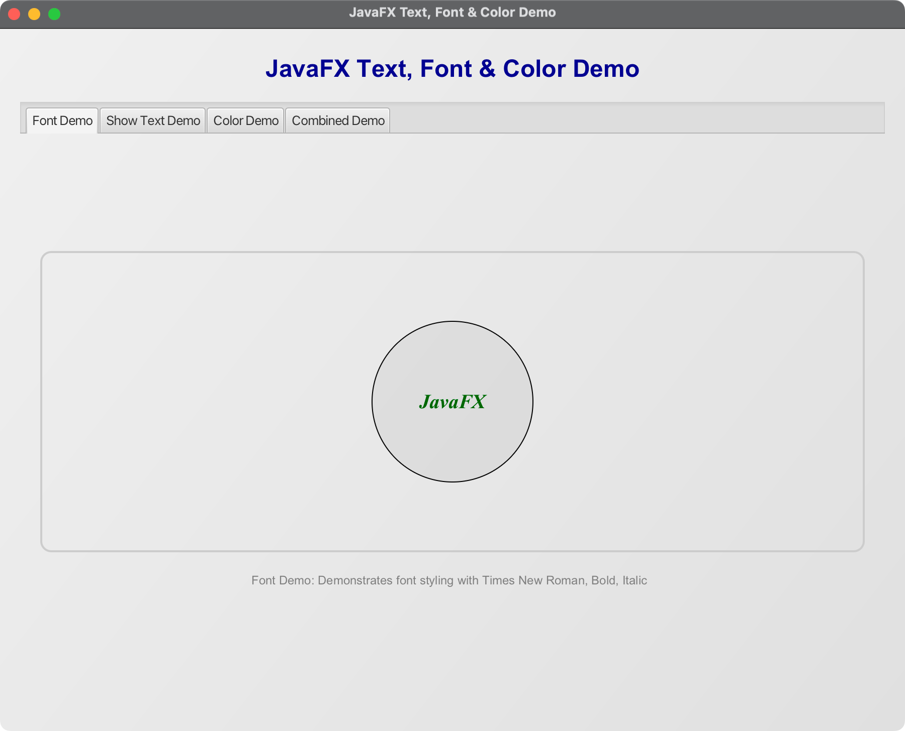
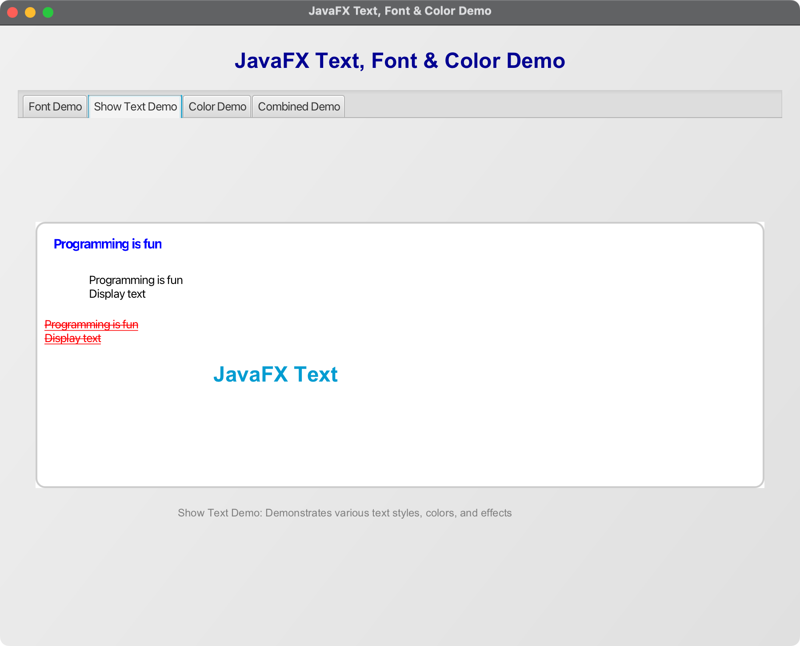
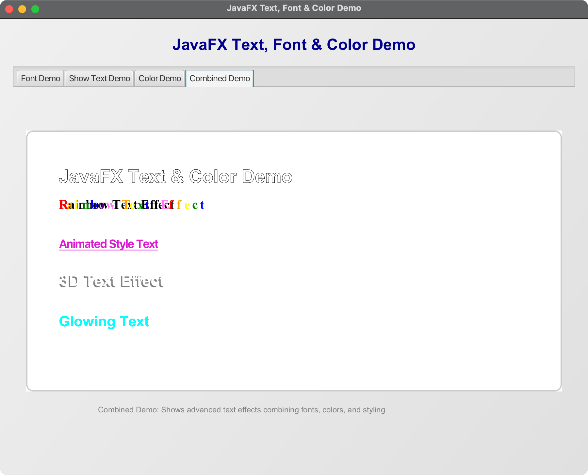

# JavaFX Text, Font & Color Demo

A comprehensive JavaFX application demonstrating the use of Text, Font, and Color classes from the JavaFX framework. This project showcases various text styling capabilities, font management, and color manipulation techniques.

## Features

### 🎨 Text Styling
- **Font Management**: Different font families, weights, and postures
- **Color Application**: Predefined colors and custom RGB values
- **Text Effects**: Underline, strikethrough, and transparency
- **Positioning**: Precise text placement and layout

### 📱 Cross-Platform Support
- **macOS**: Intel (x86_64) and Apple Silicon (ARM64)
- **Windows**: x86_64 and ARM64
- **Linux**: x86_64 and ARM64

### 🏗️ Modern Architecture
- **Java 24**: Latest Java features and performance
- **JavaFX 21**: Modern UI framework
- **Maven**: Cross-platform build system
- **Module System**: Clean dependency management

## Quick Start

### Prerequisites
- Java 24 or later
- Maven 3.9.x or later

### Running the Application

#### Using Maven (Recommended)
```bash
# Unix/Linux/macOS
./run.sh

# Windows
run.bat
```

#### Direct Execution
```bash
# Unix/Linux/macOS only
./run_direct.sh
```

## Application Structure

### Main Application (`TextFontColorDemo`)
The main application provides a tabbed interface with four demonstrations:

1. **Font Demo**: Basic font styling with circle background
2. **Show Text Demo**: Various text effects and positioning
3. **Color Demo**: Predefined colors and transparency effects
4. **Combined Demo**: Advanced text effects combining multiple techniques

### Individual Demo Classes

#### FontDemo
Based on the original FontDemo example from [Pearson LiveExample](https://liveexample.pearsoncmg.com/html/FontDemo.html).

**Features:**
- Circle background with styled text overlay
- Times New Roman font with Bold and Italic styling
- Color integration with text elements

#### ShowText
Based on the original ShowText example from [Pearson LiveExample](https://liveexample.pearsoncmg.com/html/ShowText.html).

**Features:**
- Multiple text elements with different styles
- Courier font with Bold and Italic effects
- Underline and strikethrough demonstrations
- Custom color application

## Key Classes Demonstrated

### Text Class (`javafx.scene.text.Text`)
The fundamental building block for displaying text in JavaFX applications.

```java
Text text = new Text(20, 30, "Hello World");
text.setFont(Font.font("Arial", FontWeight.BOLD, 16));
text.setFill(Color.BLUE);
text.setUnderline(true);
```

### Font Class (`javafx.scene.text.Font`)
Comprehensive font management capabilities.

```java
Font font = Font.font("Times New Roman", FontWeight.BOLD, FontPosture.ITALIC, 20);
label.setFont(font);
```

### Color Class (`javafx.scene.paint.Color`)
Color representation and manipulation.

```java
// Predefined color
Color red = Color.RED;

// Custom RGB color
Color custom = new Color(0.2, 0.6, 0.8, 1.0); // R, G, B, Alpha

// With transparency
Color transparent = new Color(1.0, 0.0, 0.0, 0.5); // 50% transparent red
```

## Project Structure

```
01-06-TextFontColor/
├── src/
│   └── main/
│       └── java/
│           ├── module-info.java
│           └── com/example/
│               ├── Launcher.java              # Application entry point
│               ├── TextFontColorDemo.java     # Main application
│               ├── FontDemo.java             # Font demonstration
│               └── ShowText.java             # Text demonstration
├── docs/
│   ├── concepts.md                           # Key concepts and design decisions
│   └── architecture.md                       # Detailed architecture documentation
├── pom.xml                                   # Maven build configuration
├── run.sh                                    # Unix/Linux/macOS execution script
├── run.bat                                   # Windows execution script
├── run_direct.sh                             # Direct execution script
├── .gitignore                                # Git ignore rules
└── README.md                                 # This file
```

## Build Configuration

### Maven Configuration
The project uses Maven with platform-specific profiles for cross-platform compatibility:

- **Platform Detection**: Automatic OS and architecture detection
- **JavaFX Dependencies**: Platform-specific JavaFX modules
- **Java 24**: Latest Java features and performance optimizations

### Cross-Platform Support
```xml
<profiles>
    <profile>
        <id>mac-aarch64</id>
        <activation>
            <os>
                <family>mac</family>
                <arch>aarch64</arch>
            </os>
        </activation>
        <properties>
            <javafx.platform>mac-aarch64</javafx.platform>
        </properties>
    </profile>
    <!-- Additional platform profiles for Windows and Linux -->
</profiles>
```

## Development

### Building from Source
```bash
# Clean and compile
mvn clean compile

# Run with Maven
mvn javafx:run

# Package application
mvn package
```

### Running Individual Demos
```bash
# Run FontDemo only
mvn exec:java -Dexec.mainClass="com.example.FontDemo"

# Run ShowText only
mvn exec:java -Dexec.mainClass="com.example.ShowText"
```

## Technical Specifications

### Development Environment
- **Target Platform**: macOS Silicon (ARM64) - primary development environment
- **Java Version**: OpenJDK 24
- **Maven Version**: 3.9.x or later
- **JavaFX Version**: 21

### Cross-Platform Compatibility
The project must be buildable and runnable on:
- **macOS**: Intel (x86_64) and Apple Silicon (ARM64)
- **Windows**: x86_64 and ARM64
- **Linux**: x86_64 and ARM64

### Performance Considerations
- Efficient rendering with hardware acceleration
- Smooth animations and transitions
- Proper memory management
- Responsive user interface

## Documentation

### Additional Documentation
- [`docs/concepts.md`](docs/concepts.md): Key concepts and design decisions
- [`docs/architecture.md`](docs/architecture.md): Detailed architecture and design patterns

### Code Quality
- Clean, well-documented code with JavaDoc comments
- Proper separation of concerns
- Error handling for user interactions
- Responsive UI design principles

## Contributing

### Code Style
- Follow Java coding conventions
- Use meaningful variable and method names
- Include comprehensive JavaDoc comments
- Maintain consistent formatting

### Testing
- Unit tests for individual components
- Integration tests for UI interactions
- Cross-platform compatibility testing
- Performance benchmarking

## Screenshots

   

