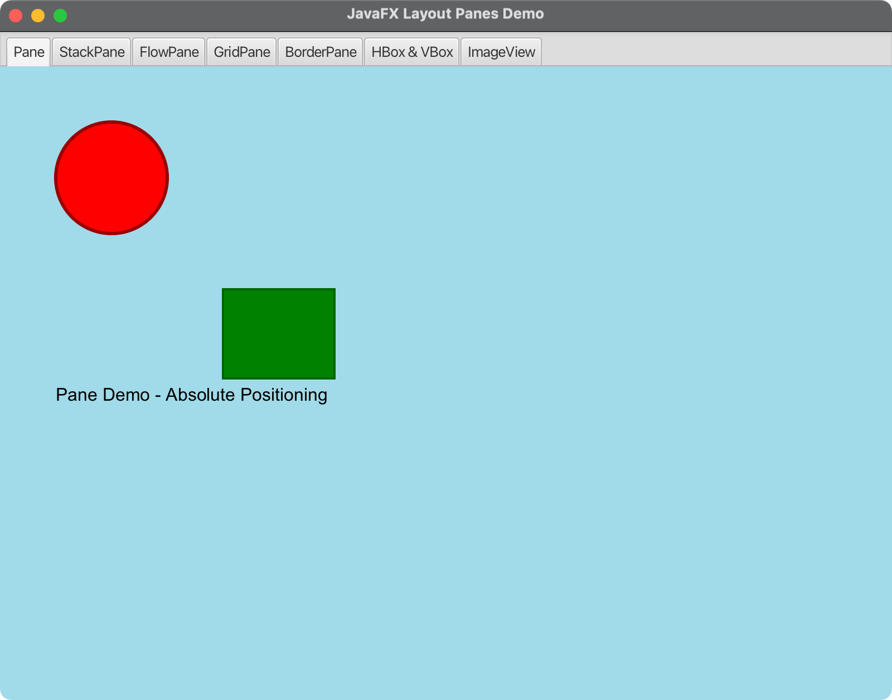
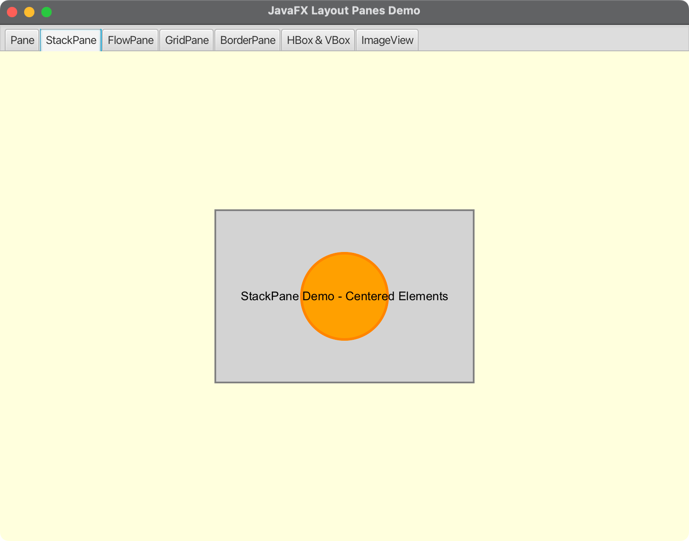
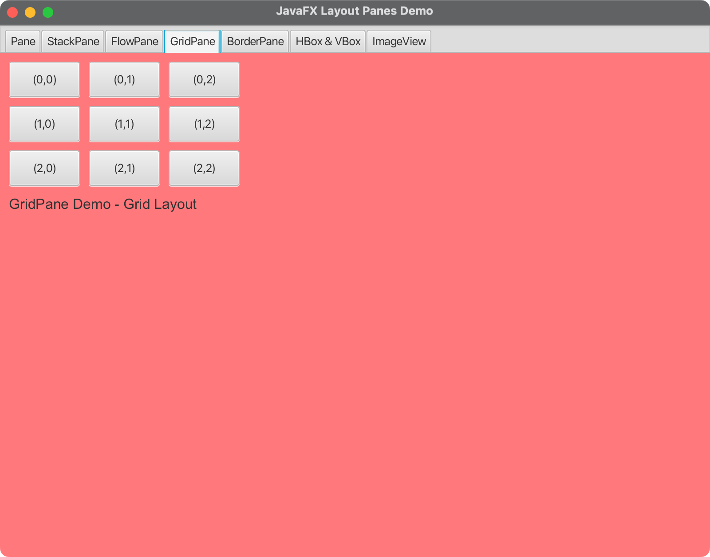
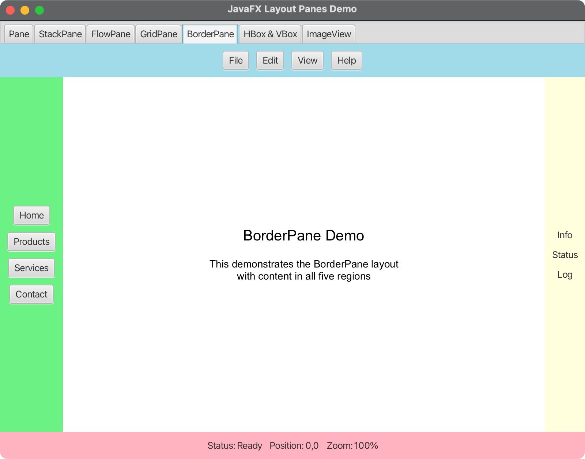
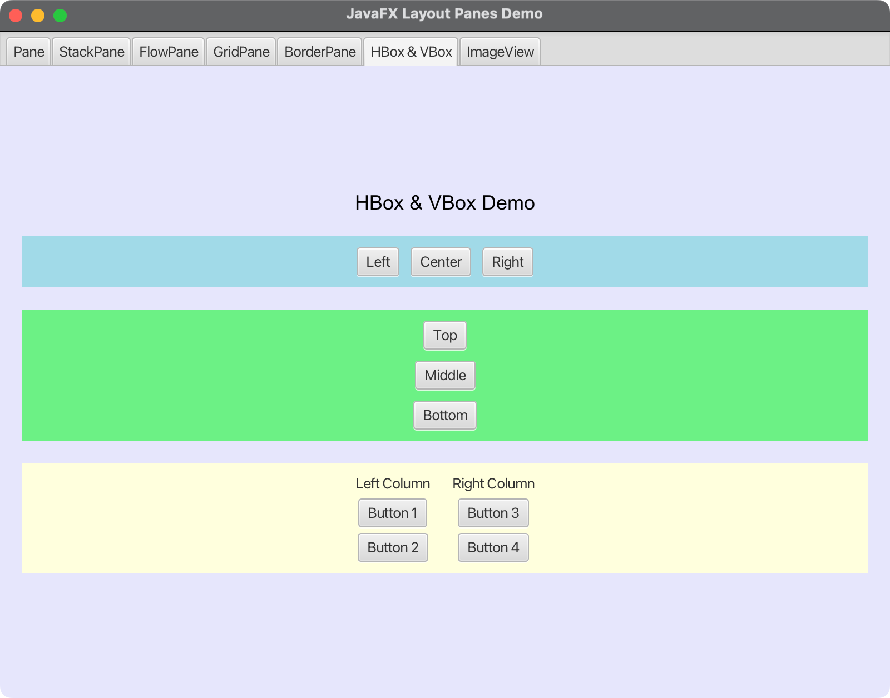
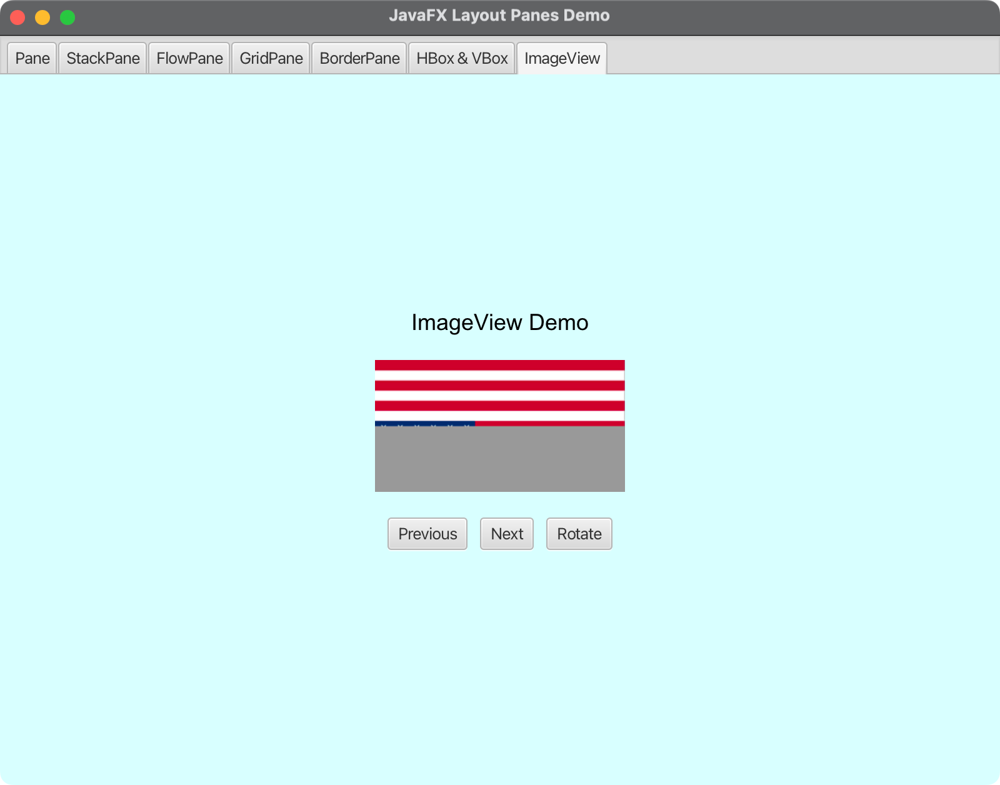

# JavaFX Layout Panes Demo

A comprehensive JavaFX application demonstrating various layout panes and ImageView functionality. This application showcases different layout management techniques available in JavaFX, providing hands-on examples of how each layout pane behaves and can be used in real applications.

## Features

### Layout Panes Demonstrated

- **Pane**: Basic container with absolute positioning
- **StackPane**: Centers all children in the center of the pane
- **FlowPane**: Arranges children in a flow layout (like text wrapping)
- **GridPane**: Arranges children in a grid pattern
- **BorderPane**: Divides the pane into five regions (top, bottom, left, right, center)
- **HBox & VBox**: Arranges children horizontally (HBox) or vertically (VBox)

### ImageView Functionality

- **Image Loading**: Load images from URLs with error handling
- **Image Manipulation**: Rotate and scale images
- **Interactive Controls**: Navigate through multiple images
- **Error Handling**: Graceful degradation when images fail to load

## Screenshots

The application provides a tab-based interface with demonstrations for each layout type:

- **Pane Tab**: Shows absolute positioning with shapes and text
- **StackPane Tab**: Demonstrates centered layout with overlays
- **FlowPane Tab**: Shows wrapping layout with buttons and shapes
- **GridPane Tab**: Displays grid-based layout with buttons
- **BorderPane Tab**: Shows five-region layout typical of application windows
- **HBox & VBox Tab**: Demonstrates horizontal and vertical layouts
- **ImageView Tab**: Interactive image viewer with rotation controls

## Technical Specifications

### Development Environment

- **Target Platform**: macOS Silicon (ARM64) - primary development environment
- **Java Version**: OpenJDK 24
- **Maven Version**: 3.9.x or later
- **JavaFX Version**: 21

### Cross-Platform Compatibility

The project is buildable and runnable on:

- **macOS**: Intel (x86_64) and Apple Silicon (ARM64)
- **Windows**: x86_64 and ARM64
- **Linux**: x86_64 and ARM64

## Quick Start

### Prerequisites

1. **Java 24**: Install OpenJDK 24 or later
2. **Maven 3.9+**: Install Apache Maven
3. **JavaFX 21**: Automatically managed by Maven

### Building and Running

#### Using Maven (Recommended)

**Unix/Linux/macOS:**
```bash
chmod +x run.sh
./run.sh
```

**Windows:**
```cmd
run.bat
```

#### Direct Java Execution

**Unix/Linux/macOS:**
```bash
chmod +x run_direct.sh
./run_direct.sh
```

#### Manual Maven Commands

```bash
# Clean and compile
mvn clean compile

# Run the application
mvn javafx:run

# Package as executable JAR
mvn clean package
```

## Project Structure

```
01-08-LayoutPanes/
├── src/
│   └── main/
│       ├── java/
│       │   ├── com/acu/javafx/layoutpanesdemo/
│       │   │   ├── Launcher.java              # Application entry point
│       │   │   └── LayoutPanesDemo.java       # Main application class
│       │   └── module-info.java               # Module configuration
│       └── resources/                         # Resources (CSS, images, etc.)
├── docs/
│   ├── architecture.md                        # Detailed architecture documentation
│   └── concepts.md                           # Main concepts and design decisions
├── pom.xml                                   # Maven build configuration
├── run.sh                                    # Unix/Linux/macOS execution script
├── run.bat                                   # Windows execution script
├── run_direct.sh                             # Direct Java execution script
└── README.md                                 # This file
```

## Layout Pane Examples

### Pane (Absolute Positioning)
```java
Pane pane = new Pane();
Circle circle = new Circle(100, 100, 50);
Rectangle rectangle = new Rectangle(200, 200, 100, 80);
pane.getChildren().addAll(circle, rectangle);
```

### StackPane (Centered Layout)
```java
StackPane stackPane = new StackPane();
Rectangle background = new Rectangle(300, 200);
Circle centerCircle = new Circle(50);
stackPane.getChildren().addAll(background, centerCircle);
```

### FlowPane (Wrapping Layout)
```java
FlowPane flowPane = new FlowPane();
flowPane.setHgap(10);
flowPane.setVgap(10);
for (int i = 1; i <= 12; i++) {
    Button button = new Button("Button " + i);
    flowPane.getChildren().add(button);
}
```

### GridPane (Grid Layout)
```java
GridPane gridPane = new GridPane();
gridPane.setHgap(10);
gridPane.setVgap(10);
for (int row = 0; row < 3; row++) {
    for (int col = 0; col < 3; col++) {
        Button button = new Button("(" + row + "," + col + ")");
        gridPane.add(button, col, row);
    }
}
```

### BorderPane (Five-Region Layout)
```java
BorderPane borderPane = new BorderPane();
borderPane.setTop(new HBox(10, new Button("File"), new Button("Edit")));
borderPane.setLeft(new VBox(10, new Button("Home"), new Button("Products")));
borderPane.setCenter(new Text("Center Content"));
```

### HBox & VBox (Linear Layouts)
```java
HBox hBox = new HBox(10);
hBox.getChildren().addAll(new Button("Left"), new Button("Center"), new Button("Right"));

VBox vBox = new VBox(10);
vBox.getChildren().addAll(new Button("Top"), new Button("Middle"), new Button("Bottom"));
```

### ImageView (Image Display)
```java
ImageView imageView = new ImageView();
imageView.setFitWidth(200);
imageView.setFitHeight(150);
imageView.setPreserveRatio(true);
imageView.setSmooth(true);

Image image = new Image("https://example.com/image.jpg");
imageView.setImage(image);
```

## Key Features

### 1. Tab-Based Interface
- **Organized Demonstrations**: Each layout type has its own tab
- **Easy Navigation**: Quick switching between different examples
- **Scalable Design**: Easy to add new layout demonstrations

### 2. Interactive Elements
- **Real-world Examples**: Buttons, controls, and shapes in each layout
- **User Interaction**: Demonstrates how layouts respond to user actions
- **Dynamic Behavior**: Layout changes based on user input

### 3. Error Handling
- **Graceful Degradation**: Handles image loading failures
- **User Feedback**: Clear error messages and fallback content
- **Robust Operation**: Continues functioning even with partial failures

### 4. Cross-Platform Support
- **Platform Detection**: Automatic detection of target platform
- **Platform-Specific Dependencies**: Appropriate JavaFX libraries for each platform
- **Build Scripts**: Cross-platform execution scripts

## Architecture

The application follows a modular architecture with:

- **Separation of Concerns**: Each layout type is implemented separately
- **Factory Pattern**: Dedicated factory methods for each layout type
- **Strategy Pattern**: Different strategies for image loading and error handling
- **Module System**: Java 9+ module system for dependency management

For detailed architecture information, see [docs/architecture.md](docs/architecture.md).

## Learning Objectives

By using this application, you will learn:

1. **Layout Fundamentals**: How different layout panes work
2. **Practical Application**: Real-world usage of each layout type
3. **Interactive Design**: How layouts respond to user interaction
4. **Image Handling**: Basic image display and manipulation
5. **Cross-Platform Development**: Building applications for multiple platforms

## Troubleshooting

### Common Issues

1. **JavaFX Not Found**
   - Ensure JavaFX 21 is installed
   - Check that Maven dependencies are correctly configured
   - Verify platform-specific classifiers in pom.xml

2. **Image Loading Failures**
   - Check internet connectivity for remote images
   - Verify image URLs are accessible
   - Application will show placeholder content for failed images

3. **Platform-Specific Issues**
   - Use appropriate build script for your platform
   - Ensure Java 24 is installed and in PATH
   - Check Maven installation and configuration

### Getting Help

- **Build Issues**: Check Maven and Java installation
- **Runtime Issues**: Verify JavaFX dependencies
- **Platform Issues**: Use platform-specific build scripts

## Contributing

To extend this application:

1. **Add New Layout Types**: Create new factory methods in LayoutPanesDemo
2. **Enhance ImageView**: Add new image manipulation features
3. **Improve Error Handling**: Add more robust error handling strategies
4. **Add Tests**: Create unit tests for new functionality

## License

This project is part of the ACU JavaFX Learning Series and is provided for educational purposes.

## References

- **JavaFX Documentation**: [https://openjfx.io/](https://openjfx.io/)
- **Layout Panes Guide**: [https://docs.oracle.com/javase/8/javafx/layout-tutorial/](https://docs.oracle.com/javase/8/javafx/layout-tutorial/)
- **ImageView API**: [https://docs.oracle.com/javase/8/javafx/api/javafx/scene/image/ImageView.html](https://docs.oracle.com/javase/8/javafx/api/javafx/scene/image/ImageView.html)

## Screenshots

      