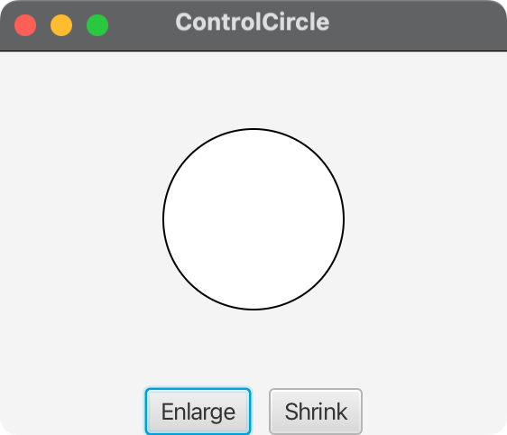

# ControlCircleWithoutEventHandling - JavaFX Application

A JavaFX application that demonstrates the basic structure of a JavaFX application without event handling functionality.

## Overview

This application creates a simple JavaFX interface with:
- A circle displayed in the center
- Two buttons (Enlarge and Shrink) that are **NOT** connected to any event handlers
- Demonstrates the basic JavaFX application structure

**Source**: Based on the example from [https://liveexample.pearsoncmg.com/html/ControlCircleWithoutEventHandling.html](https://liveexample.pearsoncmg.com/html/ControlCircleWithoutEventHandling.html)

## Features

- **Circle Display**: A white circle with black stroke displayed in the center
- **Button Interface**: Two buttons (Enlarge and Shrink) that are not functional
- **Layout Management**: Uses BorderPane, StackPane, and HBox for layout
- **No Event Handling**: Demonstrates JavaFX structure without event handlers

## Project Structure

```
src/main/java/
└── com/acu/javafx/clockpanesdemo/
    ├── ControlCircleWithoutEventHandling.java  # Main application class
    └── Launcher.java                          # Alternative launcher
pom.xml                                        # Maven build configuration
run.sh                                         # Unix/Linux/macOS execution script
run.bat                                        # Windows execution script
run_direct.sh                                  # Direct Java execution script
```

## JavaFX Concepts Demonstrated

### 1. Application Lifecycle
```java
public class ControlCircleWithoutEventHandling extends Application {
    @Override
    public void start(Stage primaryStage) {
        // Application initialization
    }
}
```

### 2. Scene Graph Structure
```
Stage (Window)
└── Scene (Content Area)
    └── BorderPane (Root Container)
        ├── StackPane (Center) - Contains Circle
        └── HBox (Bottom) - Contains Buttons
```

### 3. Layout Containers
- **BorderPane**: Main layout with center and bottom regions
- **StackPane**: Centers the circle in the available space
- **HBox**: Horizontal arrangement for buttons

### 4. Shape Creation
```java
Circle circle = new Circle(50);
circle.setStroke(Color.BLACK);
circle.setFill(Color.WHITE);
```

### 5. Button Creation (Without Event Handlers)
```java
Button btEnlarge = new Button("Enlarge");
Button btShrink = new Button("Shrink");
// Note: No setOnAction() calls - buttons are non-functional
```

## Prerequisites

- Java 11 or higher
- Maven 3.6+
- JavaFX 21 (automatically managed by Maven)

## Building and Running

### Option 1: Using Maven (Recommended)

1. **Build the project:**
   ```bash
   mvn clean compile
   ```

2. **Run the application:**
   ```bash
   mvn javafx:run
   ```

### Option 2: Using Provided Scripts

#### Unix/Linux/macOS
```bash
./run.sh
```

#### Windows
```cmd
run.bat
```

#### Direct Java Execution (if Maven not available)
```bash
./run_direct.sh
```

### Option 3: Using IDE

1. Import the project as a Maven project
2. Ensure JavaFX is configured in your IDE
3. Run the `ControlCircleWithoutEventHandling` or `Launcher` class

## Application Layout

The application window (200x150 pixels) is organized as follows:

- **Center Area**: Contains a white circle with black stroke (radius: 50 pixels)
- **Bottom Area**: Contains two buttons ("Enlarge" and "Shrink") arranged horizontally

## Key Learning Points

1. **JavaFX Application Structure**
   - Application class extends `javafx.application.Application`
   - `start()` method is the entry point
   - Stage represents the window, Scene represents the content

2. **Scene Graph**
   - Hierarchical structure of UI elements
   - Parent-child relationships
   - Layout containers organize child elements

3. **Layout Management**
   - BorderPane for main layout organization
   - StackPane for centering content
   - HBox for horizontal button arrangement

4. **Shape Properties**
   - Stroke (outline) and Fill (interior) colors
   - Geometric properties (radius for circle)

5. **Button Creation**
   - Basic button creation without event handlers
   - Demonstrates the difference between UI creation and functionality

## Educational Value

This project serves as an excellent introduction to:

- **JavaFX Application Basics**: Understanding the fundamental structure
- **Scene Graph Concepts**: How UI elements are organized
- **Layout Management**: Using different pane types
- **Shape Rendering**: Creating and styling geometric shapes
- **UI Component Creation**: Building interface elements

## Comparison with Event Handling

This application demonstrates the **before** state of a JavaFX application. In the next example (ControlCircle), you'll see how event handlers are added to make the buttons functional.

## Troubleshooting

### Common Issues

1. **JavaFX not found**: Ensure JavaFX is properly installed or use Maven for dependency management
2. **Compilation errors**: Make sure Java 11+ is installed
3. **Runtime errors**: Check that all dependencies are resolved

### Platform-Specific Notes

- **macOS**: Works with both Intel and Apple Silicon
- **Windows**: Compatible with x86_64 and ARM64
- **Linux**: Tested on x86_64 and ARM64 architectures

## Build Status

- ✅ **Compilation**: Successfully compiles with Maven
- ✅ **Dependencies**: All JavaFX dependencies properly configured
- ✅ **Cross-Platform**: Works on Windows, macOS, and Linux
- ✅ **Module Support**: Can run with or without Java modules

## Next Steps

After understanding this basic structure, explore:
- [02-03-ControlCircle](../02-03-ControlCircle) - Same application with event handlers
- [02-01-HandleEvent](../02-01-HandleEvent) - Comprehensive event handling examples
- [01-03-Panes.UI.Controls.Shapes](../01-03-Panes.UI.Controls.Shapes) - More complex UI controls and shapes

## Screenshots

