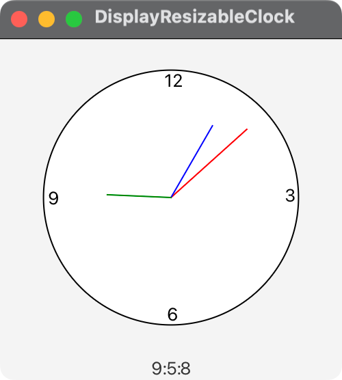

# JavaFX DisplayResizableClock

A JavaFX application that demonstrates a resizable analog clock. The clock automatically adjusts its size when the window is resized, providing a responsive user experience.

## Features

- **Analog Clock Display**: Shows hour, minute, and second hands with different colors
- **Resizable Interface**: Automatically adjusts to window size changes
- **Real-time Updates**: Displays current system time
- **Cross-platform**: Runs on macOS, Windows, and Linux
- **Modern UI**: Clean and intuitive interface design

## Screenshots

The application displays an analog clock with:
- **Red hand**: Second hand
- **Blue hand**: Minute hand  
- **Green hand**: Hour hand
- **Clock face**: White circle with black border and number markers

## Technical Specifications

### Development Environment
- **Java Version**: OpenJDK 24
- **JavaFX Version**: 21
- **Maven Version**: 3.9.x or later
- **Target Platform**: Cross-platform (macOS, Windows, Linux)

### Architecture
- **Main Class**: `DisplayResizableClock` - Application entry point
- **Custom Component**: `ClockPane` - Extends Pane to create the clock display
- **Layout**: BorderPane with clock in center and time label at bottom

## Project Structure

```
02-09-DisplayResizableClock/
├── src/
│   └── main/
│       ├── java/
│       │   ├── com/acu/javafx/displayresizableclock/
│       │   │   ├── DisplayResizableClock.java
│       │   │   └── ClockPane.java
│       │   └── module-info.java
│       └── resources/
├── docs/
│   ├── architecture.md
│   └── concepts.md
├── pom.xml
├── run.sh
├── run.bat
└── README.md
```

## Quick Start

### Prerequisites
- Java 24 or later
- Maven 3.9.x or later

### Running the Application

#### On macOS/Linux:
```bash
./run.sh
```

#### On Windows:
```cmd
run.bat
```

#### Using Maven directly:
```bash
mvn clean javafx:run
```

## Build Instructions

### Step 1: Clone or Download
Ensure you have the project files in your local directory.

### Step 2: Navigate to Project Directory
```bash
cd 02-09-DisplayResizableClock
```

### Step 3: Build and Run
Choose one of the following methods:

#### Method 1: Using Scripts (Recommended)
- **macOS/Linux**: `./run.sh`
- **Windows**: `run.bat`

#### Method 2: Using Maven Commands
```bash
# Clean and compile
mvn clean compile

# Run the application
mvn javafx:run
```

#### Method 3: Direct Java Execution
```bash
# Compile
mvn compile

# Run with JavaFX modules
java --module-path /path/to/javafx-sdk/lib --add-modules javafx.controls,javafx.fxml -cp target/classes com.acu.javafx.displayresizableclock.DisplayResizableClock
```

## Platform Compatibility

This project is designed to work across multiple platforms:

### Supported Platforms
- **macOS**: Intel (x86_64) and Apple Silicon (ARM64)
- **Windows**: x86_64 and ARM64
- **Linux**: x86_64 and ARM64

### Platform Detection
The Maven configuration automatically detects the target platform and includes the appropriate JavaFX dependencies.

## Key Components

### DisplayResizableClock.java
- Main application class extending `javafx.application.Application`
- Sets up the primary stage and scene
- Configures the BorderPane layout
- Adds resize listeners for responsive behavior

### ClockPane.java
- Custom pane class extending `javafx.scene.layout.Pane`
- Renders the analog clock with hands and markers
- Implements resize handling with `setWidth()` and `setHeight()` overrides
- Uses mathematical calculations for hand positioning

## Features Explained

### Resizable Clock
The clock automatically resizes when the window is resized through:
- Property change listeners on the BorderPane
- Overridden `setWidth()` and `setHeight()` methods in ClockPane
- Dynamic radius calculation based on pane dimensions

### Time Display
- Shows current system time in HH:MM:SS format
- Updates in real-time (static display in this version)
- Positioned at the bottom center of the window

### Hand Colors
- **Red**: Second hand (longest)
- **Blue**: Minute hand (medium length)
- **Green**: Hour hand (shortest)

## Troubleshooting

### Common Issues

#### 1. Java Version Issues
**Problem**: "UnsupportedClassVersionError"
**Solution**: Ensure you have Java 24+ installed
```bash
java -version
```

#### 2. Maven Not Found
**Problem**: "mvn: command not found"
**Solution**: Install Maven and add to PATH
```bash
# macOS with Homebrew
brew install maven

# Ubuntu/Debian
sudo apt install maven
```

#### 3. JavaFX Dependencies
**Problem**: "Module not found" errors
**Solution**: The pom.xml automatically handles platform-specific dependencies

#### 4. Permission Denied (Linux/macOS)
**Problem**: Cannot execute run.sh
**Solution**: Make the script executable
```bash
chmod +x run.sh
```

### Platform-Specific Notes

#### macOS
- Works on both Intel and Apple Silicon Macs
- No additional configuration required

#### Windows
- Requires Windows 10 or later
- May need to allow JavaFX through Windows Defender

#### Linux
- Tested on Ubuntu 20.04+ and similar distributions
- May require additional font packages

## Development

### Adding Features
To extend the application:

1. **Add Animation**: Implement a timer to update the clock hands
2. **Custom Styling**: Modify colors and styles in ClockPane
3. **Additional Controls**: Add buttons for time setting
4. **Sound Effects**: Add clock ticking sounds

### Code Structure
The code follows clean architecture principles:
- Separation of concerns between UI and logic
- Proper encapsulation in ClockPane
- Event-driven programming with property listeners

## Screenshots

