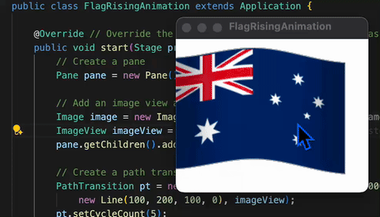

# 🚩 FlagRisingAnimation - JavaFX Flag Rising Animation Demo

A JavaFX application that demonstrates flag rising animation using PathTransition. This application shows a US flag rising from the bottom to the top of the window in a smooth, continuous animation.

## 📋 Table of Contents

- [Overview](#overview)
- [Features](#features)
- [Prerequisites](#prerequisites)
- [Installation](#installation)
- [Usage](#usage)
- [Build Instructions](#build-instructions)
- [Project Structure](#project-structure)
- [Technical Details](#technical-details)
- [Troubleshooting](#troubleshooting)
- [Development](#development)
- [Documentation](#documentation)

## 🎯 Overview

The FlagRisingAnimation demonstrates the use of JavaFX `PathTransition` animations to create a realistic flag-raising effect. The application shows a US flag image moving along a vertical path from the bottom to the top of the window, repeating the animation 5 times.

**Based on**: [Pearson Live Example](https://liveexample.pearsoncmg.com/html/FlagRisingAnimation.html)

## ✨ Features

- **Smooth Animation**: Flag rises smoothly using PathTransition
- **Automatic Playback**: Animation starts immediately when application launches
- **Multiple Cycles**: Animation repeats 5 times for continuous demonstration
- **Cross-Platform**: Works on macOS, Windows, and Linux
- **Modern UI**: Clean, professional interface
- **Resource Management**: Proper image loading and cleanup

## 🔧 Prerequisites

### System Requirements

- **Java**: OpenJDK 24 or later
- **Maven**: 3.9.x or later
- **Operating System**: macOS, Windows, or Linux
- **Architecture**: x86_64 or ARM64

### Java Installation

#### macOS
```bash
# Using Homebrew
brew install openjdk@24

# Or download from Oracle
# https://www.oracle.com/java/technologies/downloads/
```

#### Windows
```bash
# Download from Oracle
# https://www.oracle.com/java/technologies/downloads/
```

#### Linux (Ubuntu/Debian)
```bash
sudo apt update
sudo apt install openjdk-24-jdk
```

### Maven Installation

#### macOS
```bash
brew install maven
```

#### Windows
```bash
# Download from Apache Maven
# https://maven.apache.org/download.cgi
```

#### Linux
```bash
sudo apt install maven
```

## 🚀 Installation

1. **Clone or Download** the project
2. **Navigate** to the project directory:
   ```bash
   cd 02-11-FlagRisingAnimation
   ```
3. **Verify** prerequisites:
   ```bash
   java -version
   mvn -version
   ```

## 💻 Usage

### Quick Start

#### macOS/Linux
```bash
# Make script executable
chmod +x run.sh

# Run the application
./run.sh
```

#### Windows
```bash
# Run the application
run.bat
```

### Manual Execution

```bash
# Clean and compile
mvn clean compile

# Run with JavaFX plugin
mvn javafx:run
```

### Direct Java Execution

```bash
# Build the project
mvn clean package

# Run the JAR file
java -jar target/flagrisinganimation-1.0.0.jar
```

## 🔨 Build Instructions

### Full Build Process

```bash
# Clean previous builds
mvn clean

# Compile source code
mvn compile

# Run tests (if any)
mvn test

# Create executable JAR
mvn package

# Run the application
mvn javafx:run
```

### Platform-Specific Builds

The project automatically detects your platform and includes the appropriate JavaFX dependencies:

- **macOS**: `osx-x86_64` or `osx-aarch_64`
- **Windows**: `win-x86_64` or `win-aarch_64`
- **Linux**: `linux-x86_64` or `linux-aarch_64`

## 📁 Project Structure

```
02-11-FlagRisingAnimation/
├── src/
│   └── main/
│       ├── java/
│       │   ├── com/acu/javafx/flagrisinganimation/
│       │   │   └── FlagRisingAnimation.java
│       │   └── module-info.java
│       └── resources/
│           └── image/
│               └── us.gif (placeholder)
├── docs/
│   ├── architecture.md
│   └── concepts.md
├── pom.xml
├── run.sh
├── run.bat
├── .gitignore
└── README.md
```

## 🔬 Technical Details

### Animation Configuration

```java
PathTransition pt = new PathTransition(
    Duration.millis(10000),  // 10 seconds per cycle
    new Line(100, 200, 100, 0),  // Vertical path
    imageView  // Target node
);
pt.setCycleCount(5);  // Repeat 5 times
pt.play();  // Start immediately
```

### Key Components

- **FlagRisingAnimation**: Main application class
- **ImageView**: Displays the US flag image
- **PathTransition**: Controls the animation
- **Line**: Defines the vertical movement path

### Animation Parameters

| Parameter | Value | Description |
|-----------|-------|-------------|
| **Duration** | 10 seconds | Time per animation cycle |
| **Cycles** | 5 | Number of repetitions |
| **Path** | Line(100,200,100,0) | Vertical movement |
| **Start Position** | (100, 200) | Bottom center |
| **End Position** | (100, 0) | Top center |

## 🛠️ Troubleshooting

### Common Issues

#### 1. Java Version Error
**Problem**: `UnsupportedClassVersionError`
**Solution**: Ensure Java 24+ is installed
```bash
java -version
```

#### 2. Maven Not Found
**Problem**: `mvn: command not found`
**Solution**: Install Maven and add to PATH
```bash
# macOS
brew install maven

# Ubuntu/Debian
sudo apt install maven
```

#### 3. JavaFX Dependencies
**Problem**: `Module not found` errors
**Solution**: The pom.xml automatically handles platform-specific dependencies

#### 4. Permission Denied (Linux/macOS)
**Problem**: Cannot execute run.sh
**Solution**: Make the script executable
```bash
chmod +x run.sh
```

#### 5. Missing Image File
**Problem**: Image not found error
**Solution**: Ensure `us.gif` is placed in `src/main/resources/image/`

### Platform-Specific Notes

#### macOS
- Works on both Intel and Apple Silicon Macs
- No additional configuration required

#### Windows
- Requires Windows 10 or later
- May need to allow JavaFX through Windows Defender

#### Linux
- Tested on Ubuntu 20.04+ and similar distributions
- May require additional font packages

## 🚀 Development

### Adding Features

To extend the application:

1. **Add Controls**: Implement play/pause/stop buttons
2. **Multiple Flags**: Add different flag types
3. **Custom Paths**: Implement curved or diagonal paths
4. **Sound Effects**: Add flag-raising sound effects
5. **User Settings**: Add animation speed controls

### Code Structure

The code follows clean architecture principles:
- Separation of concerns between UI and animation
- Proper encapsulation in components
- Event-driven programming with automatic animation

### Testing

```bash
# Run unit tests
mvn test

# Run with specific Java version
mvn javafx:run -Djava.version=24
```

## 📚 Documentation

### Additional Documentation

- **[Concepts](docs/concepts.md)**: Key concepts and design decisions
- **[Architecture](docs/architecture.md)**: Detailed architecture and design patterns

### Key Learning Points

1. **PathTransition Animation**: Learn how to create smooth object movement
2. **Image Handling**: Understand JavaFX image loading and display
3. **Resource Management**: Proper resource loading from classpath
4. **Cross-Platform Development**: Platform-specific dependency management
5. **Animation Timing**: Duration and cycle count configuration

### Animation Concepts

- **PathTransition**: JavaFX animation for path-based movement
- **Duration**: Animation timing control
- **Cycle Count**: Animation repetition
- **Line Path**: Simple linear movement definition
- **ImageView**: Image display component

## 📸 Screenshots


