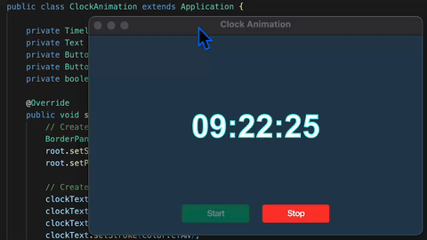

# JavaFX Clock Animation

A JavaFX application that demonstrates Timeline animation by creating a digital clock that updates in real-time. This project showcases key JavaFX animation concepts and provides a practical example of how to implement time-based animations.

## Features

- **Digital Clock Display**: Shows current time in HH:mm:ss format
- **Real-time Updates**: Updates every second using Timeline animation
- **User Controls**: Start/Stop buttons to control animation
- **Modern UI**: Dark theme with professional styling
- **Cross-platform**: Works on macOS, Windows, and Linux

## Screenshots

The application displays a digital clock with:
- Large, bold time display in white text with cyan outline
- Dark background for professional appearance
- Green "Start" and red "Stop" buttons for animation control
- Centered layout with clean, modern design

## Prerequisites

- **Java**: OpenJDK 24 or later
- **Maven**: 3.9.x or later
- **JavaFX**: 21 (included in project dependencies)

## Quick Start

### Using Maven (Recommended)

**Unix/Linux/macOS:**
```bash
./run.sh
```

**Windows:**
```cmd
run.bat
```

### Manual Execution

1. **Clone the repository:**
   ```bash
   git clone <repository-url>
   cd 02-14-ClockAnimation
   ```

2. **Build and run:**
   ```bash
   mvn clean javafx:run
   ```

## Project Structure

```
02-14-ClockAnimation/
├── src/
│   └── main/
│       ├── java/
│       │   ├── module-info.java
│       │   └── com/acu/javafx/clockanimation/
│       │       └── ClockAnimation.java
│       └── resources/
├── docs/
│   ├── architecture.md
│   └── concepts.md
├── pom.xml
├── run.sh
├── run.bat
├── .gitignore
└── README.md
```

## Key Components

### ClockAnimation.java

The main application class that demonstrates:

- **Timeline Animation**: Creates a 1-second repeating animation
- **Event Handling**: Responds to button clicks
- **State Management**: Tracks animation running state
- **UI Layout**: Uses BorderPane for organized layout
- **Styling**: Modern dark theme with accent colors

### Key Features

1. **Timeline Animation**
   ```java
   Timeline animation = new Timeline(new KeyFrame(Duration.seconds(1), e -> updateClock()));
   animation.setCycleCount(Timeline.INDEFINITE);
   ```

2. **Event Handling**
   ```java
   startButton.setOnAction(e -> startAnimation());
   stopButton.setOnAction(e -> stopAnimation());
   ```

3. **State Management**
   ```java
   private boolean isRunning = false;
   ```

## Learning Objectives

This project helps students understand:

1. **Timeline Animation**: How to create time-based animations
2. **Event Handling**: How to respond to user interactions
3. **State Management**: How to track and manage application state
4. **UI Design**: How to create attractive, functional interfaces
5. **JavaFX Layout**: How to organize UI components effectively

## Technical Details

### Animation System

- **Update Frequency**: Every 1 second
- **Animation Type**: Timeline with KeyFrame
- **Cycle Count**: Indefinite (continuous)
- **Thread Safety**: Animation runs on JavaFX Application Thread

### UI Components

- **Layout**: BorderPane with centered clock and bottom controls
- **Clock Display**: Text component with custom styling
- **Controls**: HBox containing Start/Stop buttons
- **Styling**: CSS-like styling for modern appearance

### Cross-Platform Support

- **Module System**: Java 9+ module configuration
- **Maven Build**: Cross-platform dependency management
- **Execution Scripts**: Platform-specific run scripts
- **Dependencies**: JavaFX 21 with platform detection

## Build Configuration

### Maven Configuration

The `pom.xml` includes:

- **Java 24**: Source and target compilation
- **JavaFX 21**: Platform-independent dependencies
- **OS Detection**: Automatic platform detection
- **Build Plugins**: Maven compiler and JavaFX plugins

### Module Configuration

```java
module com.acu.javafx.clockanimation {
    requires javafx.controls;
    requires javafx.graphics;
    exports com.acu.javafx.clockanimation;
}
```

## Usage

1. **Start the Application**: Run the application using the provided scripts
2. **View the Clock**: The digital clock displays the current time
3. **Control Animation**: Use Start/Stop buttons to control the animation
4. **Observe Updates**: Watch the clock update every second when running

## Development

### Adding Features

1. **New Animations**: Add new Timeline instances for different effects
2. **UI Enhancements**: Modify styling or add new components
3. **Functionality**: Add new controls or display options

### Code Style

- **JavaDoc**: Comprehensive documentation for all methods
- **Naming**: Clear, descriptive variable and method names
- **Structure**: Clean, organized code with proper separation of concerns


## Screenshots

