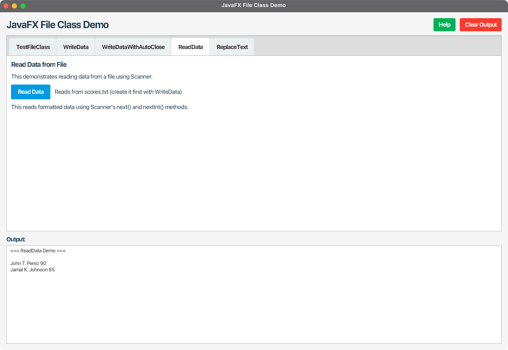
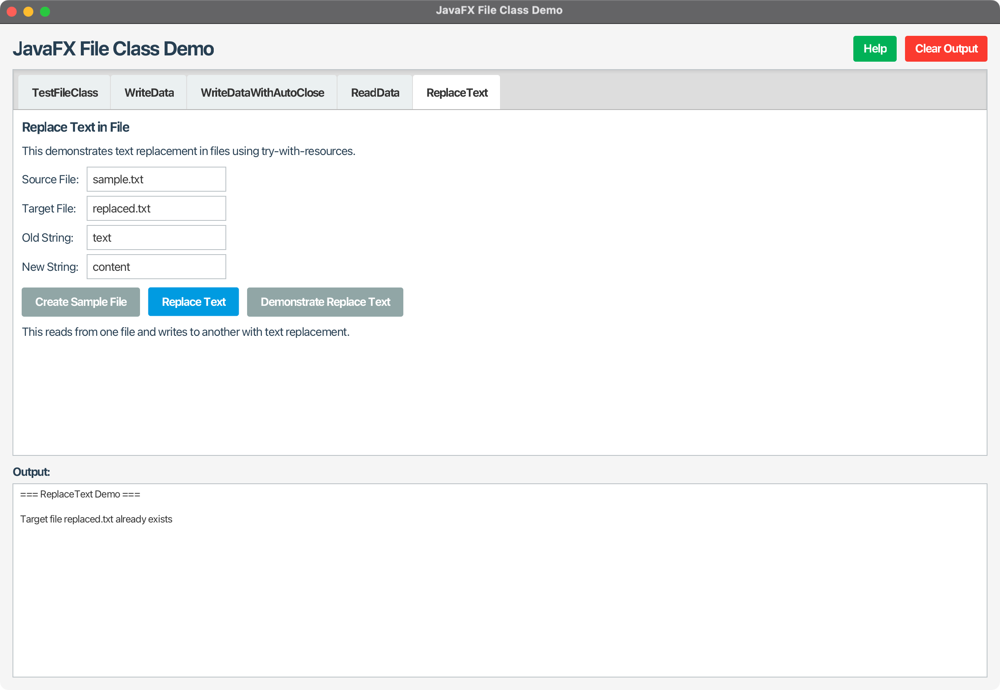
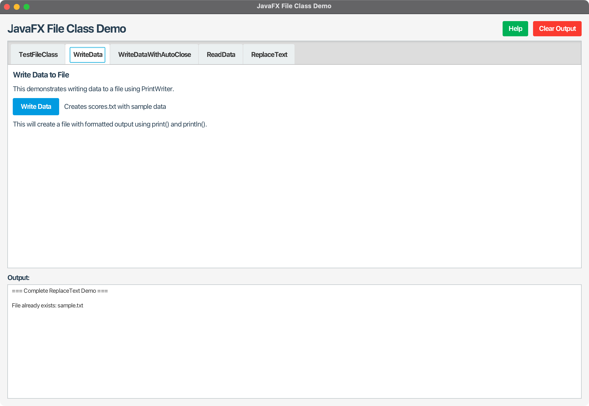

# JavaFX File Class Demo

A comprehensive JavaFX application that demonstrates various File class operations from Java I/O, including file properties, reading, writing, and text replacement. This interactive application provides hands-on experience with Java File I/O concepts.

## Features

### 🎯 Core Demonstrations

1. **TestFileClass** - File properties and information
   - Check file existence, size, permissions
   - Determine if file is directory or regular file
   - Get absolute path and last modified date

2. **WriteData** - Writing data to files
   - Use `PrintWriter` for formatted output
   - Write strings and numeric values
   - Manual resource management

3. **WriteDataWithAutoClose** - Try-with-resources
   - Automatic resource management
   - Prevents resource leaks
   - More concise than manual cleanup

4. **ReadData** - Reading data from files
   - Use `Scanner` for formatted input
   - Read different data types
   - Handle file parsing

5. **ReplaceText** - Text replacement in files
   - Read from one file, write to another
   - String replacement with `replaceAll()`
   - Command-line argument processing

### 🎨 User Interface

- **Tabbed Interface**: Each demo has its own organized tab
- **Interactive Controls**: Buttons and form fields for user input
- **Real-time Output**: Results displayed in a dedicated output area
- **Modern Styling**: Professional appearance with CSS styling
- **Cross-platform**: Consistent experience across operating systems

## Quick Start

### Prerequisites

- **Java**: OpenJDK 24 or later
- **Maven**: 3.9.x or later
- **Operating System**: macOS, Windows, or Linux

### Running the Application

#### Option 1: Using Maven (Recommended)

**macOS/Linux:**
```bash
./run.sh
```

**Windows:**
```cmd
run.bat
```

#### Option 2: Manual Maven Commands

```bash
# Clean and compile
mvn clean compile

# Run the application
mvn javafx:run
```

#### Option 3: Direct Java Execution

```bash
# Build the project
mvn clean package

# Run the JAR file
java -jar target/fileclass-1.0.0.jar
```

## Project Structure

```
05-01-FileClass/
├── src/
│   └── main/
│       ├── java/
│       │   ├── com/acu/javafx/fileclass/
│       │   │   ├── Launcher.java                    # Application entry point
│       │   │   ├── FileClassDemoController.java     # Main controller
│       │   │   └── demo/
│       │   │       ├── TestFileClass.java          # File properties demo
│       │   │       ├── WriteData.java              # Basic file writing
│       │   │       ├── WriteDataWithAutoClose.java # Try-with-resources demo
│       │   │       ├── ReadData.java               # File reading demo
│       │   │       └── ReplaceText.java            # Text replacement demo
│       │   └── module-info.java                     # Module configuration
│       └── resources/
│           ├── fxml/
│           │   └── FileClassDemo.fxml              # UI layout
│           └── styles/
│               └── styles.css                      # Application styling
├── docs/
│   ├── concepts.md                                 # Main concepts and design decisions
│   └── architecture.md                             # Detailed architecture documentation
├── pom.xml                                        # Maven build configuration
├── run.sh                                         # Unix/Linux/macOS execution script
├── run.bat                                        # Windows execution script
└── README.md                                      # This file
```

## Usage Guide

### 1. TestFileClass Tab

1. Enter a file path in the "File Path" field (default: `image/us.gif`)
2. Click "Test File Properties"
3. View the results showing file existence, size, permissions, etc.

### 2. WriteData Tab

1. Click "Write Data" to create a `scores.txt` file
2. The file will contain sample student data
3. Check the output area for success/error messages

### 3. WriteDataWithAutoClose Tab

1. Click "Write Data with Auto-Close"
2. Creates the same file using try-with-resources
3. Demonstrates automatic resource management

### 4. ReadData Tab

1. First create a file using WriteData
2. Click "Read Data" to read from `scores.txt`
3. View the parsed data in the output area

### 5. ReplaceText Tab

1. Fill in the form fields:
   - Source File: `sample.txt`
   - Target File: `replaced.txt`
   - Old String: `text`
   - New String: `content`
2. Click "Create Sample File" to create a test file
3. Click "Replace Text" to perform the replacement
4. Or click "Demonstrate Replace Text" for a complete workflow

## Technical Details

### Build System

- **Maven**: Dependency management and build automation
- **JavaFX Maven Plugin**: Handles JavaFX runtime
- **Cross-platform**: Automatic platform detection
- **Executable JAR**: Can be packaged as standalone application

### Dependencies

- **JavaFX 21**: Modern UI framework
- **OpenJDK 24**: Latest Java features
- **Maven 3.9+**: Build and dependency management

### Platform Support

- **macOS**: Intel (x86_64) and Apple Silicon (ARM64)
- **Windows**: x86_64 and ARM64
- **Linux**: x86_64 and ARM64

## Learning Objectives

This application helps you understand:

1. **File Class Operations**: How to inspect file properties and metadata
2. **Text I/O**: Reading and writing formatted text files
3. **Resource Management**: Using try-with-resources for automatic cleanup
4. **Error Handling**: Proper exception handling in I/O operations
5. **JavaFX Development**: Creating interactive applications with modern UI

## Examples from Textbook

This application implements the examples from the textbook:

- [TestFileClass](https://liveexample.pearsoncmg.com/html/TestFileClass.html)
- [WriteData](https://liveexample.pearsoncmg.com/html/WriteData.html)
- [WriteDataWithAutoClose](https://liveexample.pearsoncmg.com/html/WriteDataWithAutoClose.html)
- [ReadData](https://liveexample.pearsoncmg.com/html/ReadData.html)
- [ReplaceText](https://liveexample.pearsoncmg.com/html/ReplaceText.html)

## Troubleshooting

### Common Issues

1. **Java not found**: Install OpenJDK 24 or later
2. **Maven not found**: Install Maven 3.9.x or later
3. **JavaFX runtime error**: Ensure JavaFX dependencies are properly configured
4. **Permission denied**: Check file permissions for the project directory

### Build Issues

```bash
# Clean and rebuild
mvn clean compile

# Check Java version
java -version

# Check Maven version
mvn -version
```

## Screenshots

    