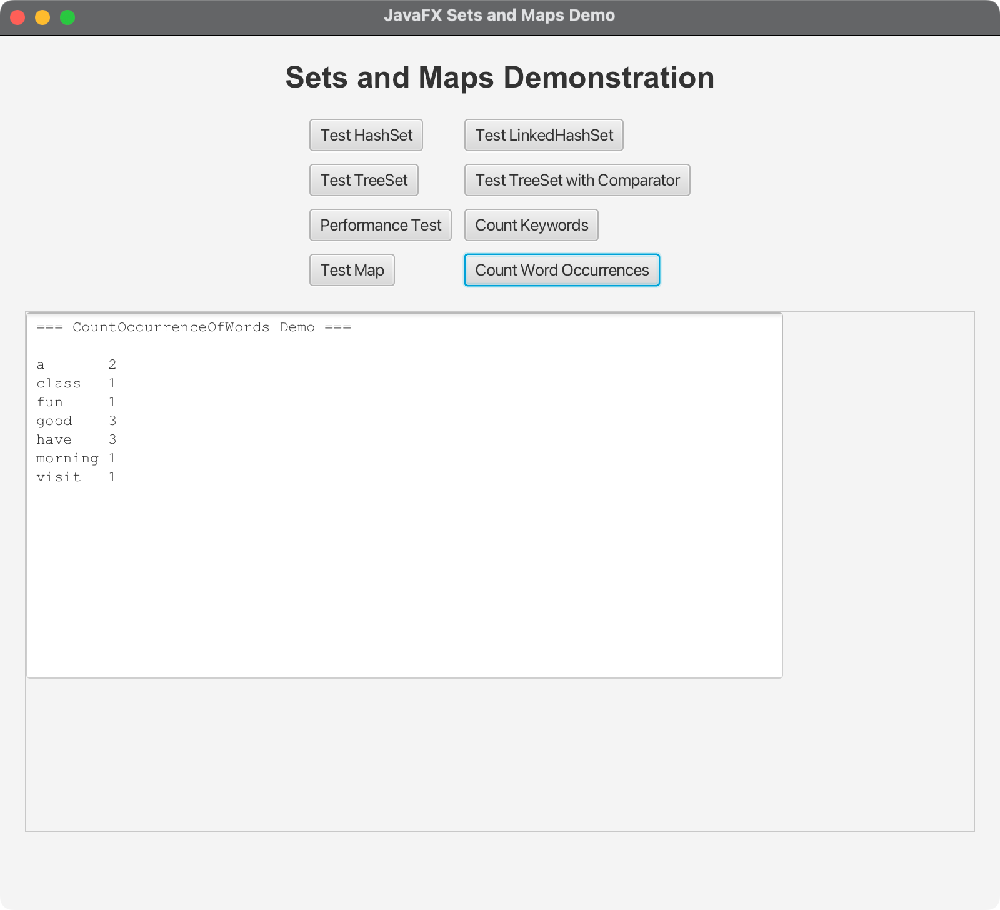

# JavaFX Sets and Maps Demo

A comprehensive JavaFX application that demonstrates various Java Collections Framework concepts, specifically focusing on Sets and Maps. This application provides an interactive graphical user interface to explore different implementations of these data structures.

## 🎯 Objectives

- Demonstrate HashSet, LinkedHashSet, and TreeSet functionality
- Show HashMap, TreeMap, and LinkedHashMap usage
- Compare performance of different collection types
- Illustrate custom comparators with geometric objects
- Provide practical examples of Sets and Maps in real-world scenarios

## 🚀 Features

### Sets Demonstrations
- **TestHashSet**: Demonstrates HashSet with string elements
- **TestLinkedHashSet**: Shows LinkedHashSet maintaining insertion order
- **TestTreeSet**: Illustrates TreeSet with natural ordering and navigable methods
- **TestTreeSetWithComparator**: Shows TreeSet with custom comparator for geometric objects

### Maps Demonstrations
- **TestMap**: Demonstrates HashMap, TreeMap, and LinkedHashMap functionality
- **CountOccurrenceOfWords**: Shows word counting using TreeMap

### Performance Testing
- **SetListPerformanceTest**: Compares performance of different collection types

### Utility Functions
- **CountKeywords**: Demonstrates keyword counting in Java source files

## 🛠️ Technical Specifications

### Development Environment
- **Java Version**: OpenJDK 24
- **JavaFX Version**: 21
- **Maven Version**: 3.9.x or later
- **Target Platform**: Cross-platform (macOS, Windows, Linux)

### Supported Architectures
- **macOS**: Intel (x86_64) and Apple Silicon (ARM64)
- **Windows**: x86_64 and ARM64
- **Linux**: x86_64 and ARM64

## 📁 Project Structure

```
07-02-Sets-Maps/
├── src/
│   ├── main/
│   │   ├── java/
│   │   │   └── com/acu/javafx/setsandmaps/
│   │   │       ├── SetsAndMapsDemo.java      # Main JavaFX application
│   │   │       ├── TestHashSet.java          # HashSet demonstration
│   │   │       ├── TestLinkedHashSet.java    # LinkedHashSet demonstration
│   │   │       ├── TestTreeSet.java          # TreeSet demonstration
│   │   │       ├── TestTreeSetWithComparator.java # TreeSet with comparator
│   │   │       ├── SetListPerformanceTest.java    # Performance comparison
│   │   │       ├── CountKeywords.java        # Keyword counting utility
│   │   │       ├── TestMap.java              # Map demonstrations
│   │   │       ├── CountOccurrenceOfWords.java    # Word counting
│   │   │       ├── GeometricObject.java      # Abstract geometric class
│   │   │       ├── Circle.java               # Circle implementation
│   │   │       ├── Rectangle.java            # Rectangle implementation
│   │   │       └── GeometricObjectComparator.java # Custom comparator
│   │   └── resources/
│   └── test/
│       └── java/
├── docs/
│   ├── architecture.md                        # Architecture documentation
│   └── concepts.md                           # Concepts and theory
├── pom.xml                                   # Maven configuration
├── run.sh                                    # Unix/Linux/macOS execution script
├── run.bat                                   # Windows execution script
├── run_direct.sh                             # Direct Java execution script
├── .gitignore                                # Git ignore rules
└── README.md                                 # This file
```

## 🚀 Quick Start

### Prerequisites
- Java 24 or later
- Maven 3.9.x or later

### Running the Application

#### Option 1: Using Maven (Recommended)
```bash
# Unix/Linux/macOS
./run.sh

# Windows
run.bat
```

#### Option 2: Direct Maven Commands
```bash
# Clean and compile
mvn clean compile

# Run the application
mvn javafx:run
```

#### Option 3: Direct Java Execution
```bash
# Unix/Linux/macOS only
./run_direct.sh
```

## 🎮 Using the Application

1. **Launch the Application**: Run one of the execution scripts
2. **Select a Demonstration**: Click any of the 8 demonstration buttons
3. **View Results**: Output will appear in the text area
4. **File Operations**: For "Count Keywords", use the file chooser to select a Java source file

### Available Demonstrations

| Button | Description |
|--------|-------------|
| Test HashSet | Demonstrates HashSet with city names |
| Test LinkedHashSet | Shows LinkedHashSet maintaining order |
| Test TreeSet | Illustrates TreeSet with navigable methods |
| Test TreeSet with Comparator | Shows custom comparator with geometric objects |
| Performance Test | Compares performance of different collections |
| Count Keywords | Counts Java keywords in a source file |
| Test Map | Demonstrates HashMap, TreeMap, LinkedHashMap |
| Count Word Occurrences | Counts word frequency in sample text |

## 📚 Key Concepts Demonstrated

### Sets
- **HashSet**: Unordered, unique elements with O(1) average operations
- **LinkedHashSet**: Maintains insertion order with uniqueness
- **TreeSet**: Sorted elements with O(log n) operations

### Maps
- **HashMap**: Unordered key-value pairs with O(1) average operations
- **TreeMap**: Sorted key-value pairs with O(log n) operations
- **LinkedHashMap**: Maintains insertion/access order

### Advanced Features
- **Custom Comparators**: GeometricObjectComparator for area-based sorting
- **Performance Analysis**: Comparison of different collection types
- **File Processing**: Keyword counting in Java source files
- **Text Analysis**: Word frequency counting

## 🔧 Build Configuration

### Maven Configuration
The `pom.xml` includes:
- Cross-platform JavaFX dependencies
- Platform-specific classifiers
- Maven compiler plugin for Java 24
- JavaFX Maven plugin for running the application
- Maven Shade plugin for creating executable JARs

### Platform Detection
The build automatically detects the target platform:
- **macOS**: Uses `mac` classifier
- **Windows**: Uses `win` classifier
- **Linux**: Uses `linux` classifier

## 🏗️ Architecture

### Design Patterns
- **MVC Pattern**: Model (demonstration classes), View (JavaFX UI), Controller (SetsAndMapsDemo)
- **Strategy Pattern**: Different collection implementations for different use cases
- **Factory Pattern**: GeometricObject hierarchy for creating shapes

### Threading
- Performance tests run in background threads
- UI updates use Platform.runLater()
- Non-blocking user interface

## 📖 Documentation

### Architecture Documentation (`docs/architecture.md`)
- Detailed architecture overview
- Component descriptions
- Design patterns used
- Cross-platform compatibility
- Performance considerations
- Error handling strategies

### Concepts Documentation (`docs/concepts.md`)
- Java Collections Framework overview
- Sets and Maps theory
- Performance analysis
- Best practices
- Real-world applications
- Common pitfalls

## Screenshots

