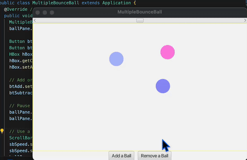

# Multiple Bounce Ball JavaFX Application

A JavaFX application that demonstrates multiple bouncing balls with interactive controls for adding/removing balls, pausing/resuming animation, and controlling animation speed.

## Project Status: ✅ Complete

This project has been successfully created with:
- ✅ JavaFX application with multiple bouncing balls
- ✅ Cross-platform Maven build configuration
- ✅ Platform-specific execution scripts
- ✅ Comprehensive documentation
- ✅ Proper project structure and organization

## Features

- **Multiple Bouncing Balls**: Add and remove balls dynamically
- **Interactive Controls**: 
  - `+` button to add a new ball
  - `-` button to remove the last ball
  - Mouse press/release to pause/resume animation
  - Scroll bar to control animation speed
- **Smooth Animation**: 50ms frame rate for smooth ball movement
- **Boundary Detection**: Balls bounce off the pane boundaries
- **Random Colors**: Each new ball gets a random semi-transparent color

## Technical Specifications

### Development Environment

- **Target Platform**: macOS Silicon (ARM64) - primary development environment
- **Java Version**: OpenJDK 24
- **Maven Version**: 3.9.x or later
- **JavaFX Version**: 21

### Cross-Platform Compatibility

The project is buildable and runnable on:

- **macOS**: Intel (x86_64) and Apple Silicon (ARM64)
- **Windows**: x86_64 and ARM64
- **Linux**: x86_64 and ARM64

## Project Structure

```
07-03-MultipleBounceBall/
├── src/
│   ├── main/
│   │   ├── java/
│   │   │   └── com/acu/javafx/multiplebounceball/
│   │   │       └── MultipleBounceBall.java
│   │   └── resources/
│   └── test/
│       └── java/
├── pom.xml
├── run.sh
├── run.bat
├── run_direct.sh
└── README.md
```

## Quick Start

### Prerequisites

1. **Java 24**: Install OpenJDK 24 or later
2. **Maven 3.9+**: Install Apache Maven
3. **JavaFX 21**: The project includes JavaFX dependencies

### Running the Application

#### Option 1: Using Maven (Recommended)

**On macOS/Linux:**
```bash
./run.sh
```

**On Windows:**
```cmd
run.bat
```

#### Option 2: Direct Java Execution (Development)

**On macOS/Linux:**
```bash
./run_direct.sh
```

**Note**: This requires JavaFX to be installed separately on your system.

#### Option 3: Manual Maven Commands

```bash
# Clean and compile
mvn clean compile

# Run the application
mvn javafx:run
```

## Application Controls

### UI Elements

1. **Scroll Bar (Top)**: Controls animation speed (0-20)
2. **Ball Pane (Center)**: Yellow-bordered area where balls bounce
3. **Control Buttons (Bottom)**:
   - `+` button: Adds a new ball with random color
   - `-` button: Removes the last ball

### Mouse Interactions

- **Mouse Press**: Pauses the animation
- **Mouse Release**: Resumes the animation

## Architecture

### Main Components

1. **MultipleBounceBall**: Main application class extending `Application`
2. **MultipleBallPane**: Custom pane class managing ball animation
3. **Ball**: Custom circle class with movement properties

### Key Design Patterns

- **Observer Pattern**: Event handling for mouse and button interactions
- **Strategy Pattern**: Animation rate control through property binding
- **Factory Pattern**: Ball creation with random properties

### Animation System

- **Timeline**: JavaFX Timeline for smooth animation
- **KeyFrame**: 50ms intervals for ball movement updates
- **Property Binding**: Scroll bar value bound to animation rate

## Build Configuration

### Maven Configuration

The `pom.xml` includes:

- **Platform Detection**: Automatic architecture detection
- **JavaFX Dependencies**: Platform-specific classifiers
- **Cross-Platform Support**: Works on all target platforms
- **Java 24 Configuration**: Latest Java features
- **Executable JAR**: Maven Shade plugin for standalone JAR

### Platform-Specific Features

- **macOS**: Native ARM64 and x86_64 support
- **Windows**: x86_64 and ARM64 compatibility
- **Linux**: x86_64 and ARM64 compatibility

## Screenshots

