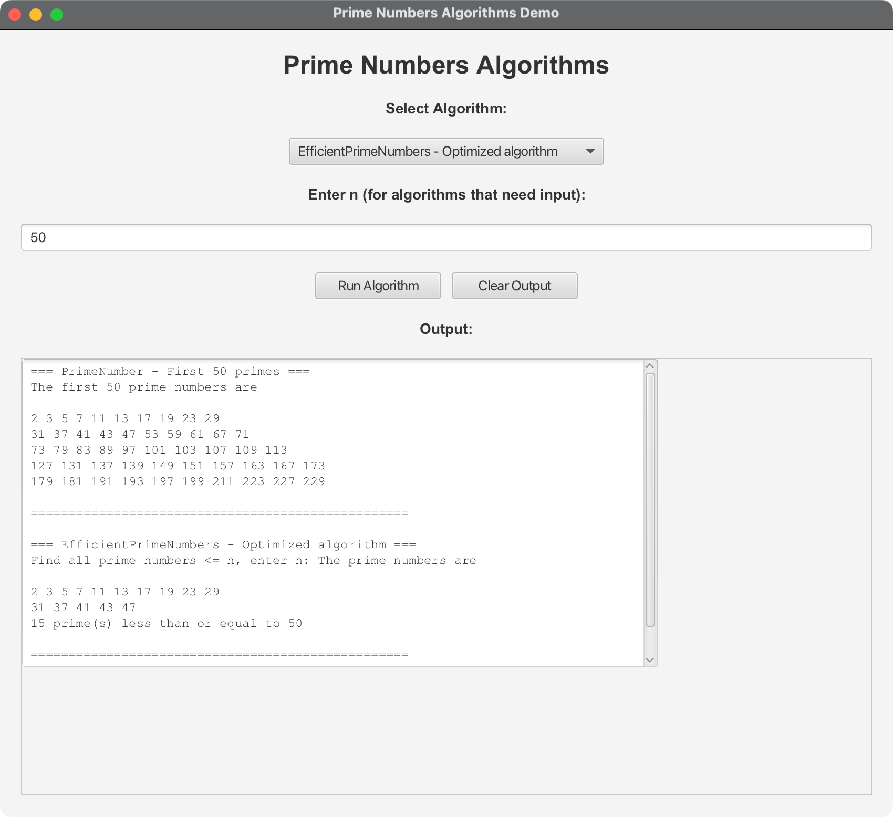

# Prime Numbers Algorithms Demo

A JavaFX application that demonstrates four different prime number algorithms from the textbook "Introduction to Java Programming and Data Structures, 13E" by Y. Daniel Liang.

## Overview

This application provides an interactive GUI to run and compare different prime number algorithms:

1. **PrimeNumber** - Finds the first 50 prime numbers using basic trial division
2. **PrimeNumbers** - Finds all prime numbers ≤ n using optimized trial division
3. **EfficientPrimeNumbers** - Uses an optimized algorithm with a list of known primes
4. **SieveOfEratosthenes** - Implements the classic Sieve of Eratosthenes algorithm

## Features

- **Interactive GUI**: Modern JavaFX interface with dropdown selection and input fields
- **Real-time Output**: Captures and displays console output in a scrollable text area
- **Multiple Algorithms**: Compare different approaches to finding prime numbers
- **Cross-platform**: Works on macOS, Windows, and Linux
- **Input Validation**: Handles user input for algorithms that require it

## Algorithms Explained

### 1. PrimeNumber
- **Purpose**: Finds the first 50 prime numbers
- **Method**: Basic trial division up to n/2
- **Complexity**: O(n²) for each number tested
- **Use Case**: Educational demonstration of basic prime testing

### 2. PrimeNumbers
- **Purpose**: Finds all primes ≤ n
- **Method**: Trial division up to √n (optimized)
- **Complexity**: O(n√n)
- **Use Case**: Finding primes up to a specific limit

### 3. EfficientPrimeNumbers
- **Purpose**: Finds all primes ≤ n efficiently
- **Method**: Uses list of known primes for testing
- **Complexity**: O(n log log n)
- **Use Case**: More efficient than basic trial division

### 4. SieveOfEratosthenes
- **Purpose**: Finds all primes ≤ n using sieve method
- **Method**: Marks non-prime numbers in a boolean array
- **Complexity**: O(n log log n)
- **Use Case**: Most efficient for finding all primes up to n

## Technical Specifications

### Development Environment
- **Java Version**: OpenJDK 24
- **JavaFX Version**: 21
- **Maven Version**: 3.9.x or later
- **Target Platform**: Cross-platform (macOS, Windows, Linux)

### Supported Architectures
- **macOS**: Intel (x86_64) and Apple Silicon (ARM64)
- **Windows**: x86_64 and ARM64
- **Linux**: x86_64 and ARM64

## Installation and Setup

### Prerequisites
1. **Java 24 or later** - [Download OpenJDK](https://adoptium.net/)
2. **Maven 3.9.x or later** - [Download Maven](https://maven.apache.org/download.cgi)

### Quick Start

#### On macOS/Linux:
```bash
# Make scripts executable
chmod +x run.sh run_direct.sh

# Run with Maven (recommended)
./run.sh

# Or run directly (requires JavaFX installation)
./run_direct.sh
```

#### On Windows:
```cmd
# Run with Maven (recommended)
run.bat
```

#### Using Maven directly:
```bash
# Clean and compile
mvn clean compile

# Run the application
mvn javafx:run

# Or build executable JAR
mvn clean package
java -jar target/prime-numbers-demo-1.0.0.jar
```

## Usage

1. **Select Algorithm**: Choose from the dropdown menu
2. **Enter Input**: For algorithms that need input, enter a number (e.g., 100)
3. **Run Algorithm**: Click "Run Algorithm" to execute
4. **View Results**: Output appears in the scrollable text area
5. **Clear Output**: Use "Clear Output" to start fresh

### Example Usage

1. Select "PrimeNumber - First 50 primes" and click "Run Algorithm"
   - Shows the first 50 prime numbers

2. Select "SieveOfEratosthenes - Sieve algorithm", enter "100", and click "Run Algorithm"
   - Shows all prime numbers ≤ 100

## Project Structure

```
08-07-PrimeNumbers/
├── src/main/java/com/acu/javafx/primenumbers/
│   ├── PrimeNumber.java              # Basic prime number algorithm
│   ├── PrimeNumbers.java             # Optimized trial division
│   ├── EfficientPrimeNumbers.java    # List-based optimization
│   ├── SieveOfEratosthenes.java     # Sieve algorithm
│   └── PrimeNumbersDemo.java        # Main JavaFX application
├── pom.xml                          # Maven configuration
├── run.sh                           # Unix/Linux/macOS script
├── run.bat                          # Windows script
├── run_direct.sh                    # Direct Java execution
└── README.md                        # This file
```

## Build Configuration

### Maven Configuration
The `pom.xml` includes:
- JavaFX dependencies with platform-specific classifiers
- Maven compiler plugin configured for Java 24
- JavaFX Maven plugin for running the application
- Maven Shade plugin for creating executable JARs
- Cross-platform profiles for different operating systems

### Platform Detection
The build automatically detects the platform and includes appropriate JavaFX modules:
- **macOS**: Uses `mac` profile
- **Windows**: Uses `windows` profile  
- **Linux**: Uses `linux` profile

## Troubleshooting

### Common Issues

1. **JavaFX not found**
   - Solution: Use the Maven script (`run.sh` or `run.bat`) which handles dependencies automatically

2. **Java version too old**
   - Solution: Install Java 24 or later from [Adoptium](https://adoptium.net/)

3. **Maven not found**
   - Solution: Install Maven from [Apache Maven](https://maven.apache.org/download.cgi)

4. **Permission denied on scripts**
   - Solution: Run `chmod +x run.sh run_direct.sh` on Unix-like systems

### Platform-Specific Notes

#### macOS
- JavaFX is automatically managed by Maven
- Works on both Intel and Apple Silicon Macs

#### Windows
- Use `run.bat` for easiest execution
- Ensure Java and Maven are in PATH

#### Linux
- May need to install additional packages: `sudo apt-get install openjfx`
- Use `run.sh` for execution

## Performance Comparison

| Algorithm | Time Complexity | Space Complexity | Best For |
|-----------|----------------|------------------|----------|
| PrimeNumber | O(n²) | O(1) | Educational |
| PrimeNumbers | O(n√n) | O(1) | Small ranges |
| EfficientPrimeNumbers | O(n log log n) | O(π(n)) | Medium ranges |
| SieveOfEratosthenes | O(n log log n) | O(n) | Large ranges |

## Screenshots



