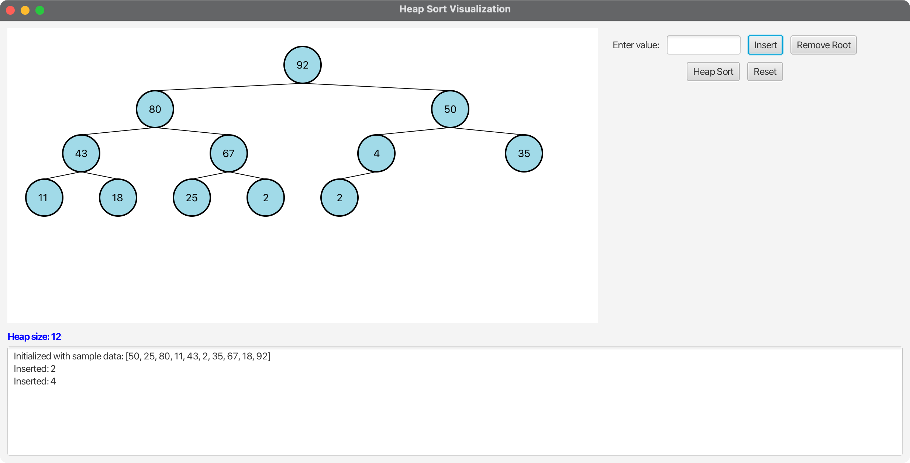

# Heap Sort Visualization

A JavaFX application that demonstrates the heap sort algorithm with interactive visualization.

## Overview

This project provides an interactive visualization of the heap data structure and heap sort algorithm. Users can:

- Insert values into a heap and see the tree structure update in real-time
- Remove the root element from the heap
- Perform heap sort on a collection of values
- Visualize the heap as a binary tree
- View the sorting process and results

## Features

### Interactive Heap Operations
- **Insert**: Add new values to the heap with automatic rebalancing
- **Remove Root**: Remove the maximum element from the heap
- **Visual Tree**: Real-time visualization of the heap as a binary tree
- **Status Display**: Shows heap size and current state

### Heap Sort Implementation
- **Complete Algorithm**: Full implementation of heap sort
- **Step-by-step Process**: Visual feedback during sorting
- **Result Display**: Shows original and sorted arrays

### User Interface
- **Canvas-based Visualization**: Clean, modern tree drawing
- **Control Panel**: Easy-to-use buttons and input fields
- **Log Output**: Detailed operation logging
- **Responsive Design**: Adapts to different screen sizes

## Technical Specifications

### Development Environment
- **Java Version**: OpenJDK 24
- **JavaFX Version**: 21
- **Maven Version**: 3.9.x or later
- **Target Platform**: Cross-platform (macOS, Windows, Linux)

### Architecture
- **Package Structure**: `com.acu.javafx.heapsort`
- **Main Classes**:
  - `HeapSortDemo`: Main JavaFX application
  - `Heap`: Generic heap implementation
  - `HeapSort`: Heap sort algorithm implementation

## Project Structure

```
09-02-HeapSort/
├── src/
│   ├── main/
│   │   ├── java/
│   │   │   └── com/acu/javafx/heapsort/
│   │   │       ├── HeapSortDemo.java    # Main JavaFX application
│   │   │       ├── Heap.java            # Heap data structure
│   │   │       └── HeapSort.java        # Heap sort algorithm
│   │   └── resources/
│   └── test/
├── docs/
│   ├── concepts.md                       # Algorithm concepts
│   └── architecture.md                   # Architecture documentation
├── pom.xml                              # Maven configuration
├── run.sh                               # Unix/Linux/macOS run script
├── run.bat                              # Windows run script
├── run_direct.sh                        # Direct Java execution script
└── README.md                            # This file
```

## Build and Run Instructions

### Prerequisites
- Java 24 or higher
- Maven 3.9.x or later
- JavaFX 21 (included in Maven dependencies)

### Using Maven (Recommended)

#### Unix/Linux/macOS
```bash
# Make scripts executable
chmod +x run.sh run_direct.sh

# Run with Maven
./run.sh
```

#### Windows
```cmd
# Run with Maven
run.bat
```

### Manual Maven Commands
```bash
# Clean and compile
mvn clean compile

# Run the application
mvn javafx:run

# Package as executable JAR
mvn clean package
```

### Direct Java Execution (Advanced)
```bash
# Compile first
mvn compile

# Run directly (requires JavaFX installation)
./run_direct.sh
```

## Usage Guide

### Getting Started
1. Run the application using one of the provided scripts
2. The application will start with sample data pre-loaded
3. Use the control panel to interact with the heap

### Heap Operations
- **Insert Value**: Enter a number in the text field and click "Insert"
- **Remove Root**: Click "Remove Root" to remove the maximum element
- **Reset**: Click "Reset" to clear the heap and start over

### Heap Sort
- **Perform Sort**: Click "Heap Sort" to sort the current heap values
- **View Results**: Check the output area for sorting details
- **Visual Feedback**: The tree will update to show the sorted structure

### Understanding the Visualization
- **Tree Structure**: Each node shows its value
- **Parent-Child Relationships**: Lines connect parent nodes to their children
- **Heap Property**: The tree maintains the heap property (parent ≥ children)
- **Color Coding**: Nodes are colored light blue for easy identification

## Algorithm Details

### Heap Data Structure
The heap is implemented as a complete binary tree stored in an array:
- **Parent Index**: `(i - 1) / 2`
- **Left Child**: `2 * i + 1`
- **Right Child**: `2 * i + 2`

### Heap Sort Algorithm
1. **Build Heap**: Convert array to max heap
2. **Extract Elements**: Repeatedly remove root (maximum) element
3. **Sort**: Place extracted elements in sorted order

### Time Complexity
- **Heap Construction**: O(n)
- **Heap Sort**: O(n log n)
- **Insert/Remove**: O(log n)

## Cross-Platform Compatibility

### Supported Platforms
- **macOS**: Intel (x86_64) and Apple Silicon (ARM64)
- **Windows**: x86_64 and ARM64
- **Linux**: x86_64 and ARM64

### Platform-Specific Considerations
- **macOS**: Uses Homebrew JavaFX installation path
- **Windows**: Uses Windows-specific batch scripts
- **Linux**: Uses system JavaFX installation

## Troubleshooting

### Common Issues

#### Java Version Issues
```
Error: Java 24 or higher required
```
**Solution**: Install OpenJDK 24 or higher

#### Maven Issues
```
Error: Maven not found
```
**Solution**: Install Maven 3.9.x or later

#### JavaFX Issues
```
Error: JavaFX modules not found
```
**Solution**: Use Maven to run the application (recommended)

#### Build Issues
```
Error: Compilation failed
```
**Solution**: Ensure Java 24+ and Maven are properly installed

### Platform-Specific Issues

#### macOS
- If JavaFX not found, install via Homebrew: `brew install openjfx`
- For Apple Silicon, ensure ARM64 Java is installed

#### Windows
- Ensure Java and Maven are in PATH
- Use `run.bat` for Windows-specific execution

#### Linux
- Install JavaFX: `sudo apt-get install openjfx` (Ubuntu/Debian)
- Or use Maven which includes JavaFX dependencies

## Development

### Adding Features
1. Modify `HeapSortDemo.java` for UI changes
2. Update `Heap.java` for heap implementation changes
3. Extend `HeapSort.java` for algorithm modifications

### Testing
```bash
# Run tests
mvn test

# Run with specific profile
mvn javafx:run -Pmac
```

### Building for Distribution
```bash
# Create executable JAR
mvn clean package

# Run JAR file
java -jar target/heapsort-1.0.0.jar
```

## Screenshots



