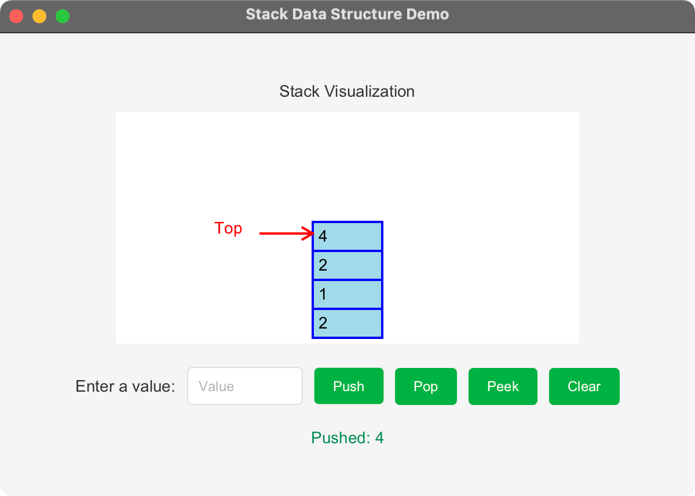

# JavaFX Stack Data Structure Demo

A JavaFX application that demonstrates the Stack data structure with an interactive visual interface.

## Overview

This project implements a visual demonstration of the Stack data structure using JavaFX. The application allows users to:

- **Push** elements onto the stack
- **Pop** elements from the top of the stack
- **Peek** at the top element without removing it
- **Clear** the entire stack
- **Visualize** the stack structure in real-time

## Features

- **Interactive Visualization**: Real-time visual representation of the stack
- **User-Friendly Interface**: Intuitive controls with buttons and input fields
- **Error Handling**: Proper validation and user feedback
- **Cross-Platform**: Runs on macOS, Windows, and Linux
- **Modern UI**: Clean, responsive design with CSS styling

## Technical Specifications

### Development Environment
- **Java Version**: OpenJDK 24
- **JavaFX Version**: 21
- **Maven Version**: 3.9.x or later
- **Target Platform**: Cross-platform (macOS, Windows, Linux)

### Architecture
- **Package**: `com.acu.javafx.stack`
- **Main Class**: `StackDemo`
- **Stack Implementation**: `Stack` and `GenericStack<E>`

## Project Structure

```
10-03-Stack/
├── src/
│   ├── main/
│   │   ├── java/
│   │   │   └── com/acu/javafx/stack/
│   │   │       ├── StackDemo.java          # Main JavaFX application
│   │   │       ├── Stack.java              # Simple stack implementation
│   │   │       └── GenericStack.java       # Generic stack implementation
│   │   └── resources/
│   │       └── styles.css                  # CSS styling
│   └── test/
│       └── java/                           # Unit tests (future)
├── docs/
│   ├── concepts.md                         # Main concepts and design decisions
│   └── architecture.md                     # Detailed architecture documentation
├── pom.xml                                 # Maven build configuration
├── run.sh                                  # Unix/Linux/macOS execution script
├── run.bat                                 # Windows execution script
└── README.md                               # This file
```

## Installation and Setup

### Prerequisites

1. **Java 24** or later
2. **Maven 3.9.x** or later
3. **Git** (for cloning the repository)

### Build and Run

#### Using Maven (Recommended)

```bash
# Clone the repository
git clone <repository-url>
cd 10-03-Stack

# Build the project
mvn clean compile

# Run the application
mvn javafx:run
```

#### Using Build Scripts

**On macOS/Linux:**
```bash
./run.sh
```

**On Windows:**
```cmd
run.bat
```

#### Direct Java Execution

```bash
# Compile
mvn clean compile

# Run with Java
java --module-path /path/to/javafx-sdk/lib --add-modules javafx.controls,javafx.fxml -cp target/classes com.acu.javafx.stack.StackDemo
```

## Usage

1. **Launch the Application**: Run the application using one of the methods above
2. **Enter Values**: Type a value in the text field
3. **Push**: Click "Push" to add the value to the top of the stack
4. **Pop**: Click "Pop" to remove the top element
5. **Peek**: Click "Peek" to view the top element without removing it
6. **Clear**: Click "Clear" to empty the stack

## Stack Implementation

### Simple Stack (`Stack.java`)
- Non-generic implementation using `ArrayList<Object>`
- Based on the JavaScript implementation from the original animation
- Methods: `push()`, `pop()`, `peek()`, `getSize()`, `isEmpty()`

### Generic Stack (`GenericStack.java`)
- Generic implementation using `ArrayList<E>`
- Based on the Java implementation from the original source
- Type-safe operations
- Methods: `push(E)`, `pop()`, `peek()`, `getSize()`, `isEmpty()`

## Visual Features

- **Canvas Rendering**: Real-time stack visualization
- **Color Coding**: Different colors for stack elements and UI components
- **Status Updates**: Real-time feedback on operations
- **Error Handling**: User-friendly error messages
- **Responsive Design**: Adapts to different window sizes

## Cross-Platform Compatibility

The application is designed to run on:
- **macOS**: Intel (x86_64) and Apple Silicon (ARM64)
- **Windows**: x86_64 and ARM64
- **Linux**: x86_64 and ARM64

## Development

### Building from Source

```bash
# Clean and compile
mvn clean compile

# Run tests (when implemented)
mvn test

# Package the application
mvn package

# Run the packaged application
java -jar target/javafx-stack-demo-1.0.0.jar
```

### Code Structure

- **`StackDemo.java`**: Main JavaFX application with UI logic
- **`Stack.java`**: Simple stack implementation
- **`GenericStack.java`**: Generic stack implementation
- **`styles.css`**: CSS styling for the application


## Screenshots




