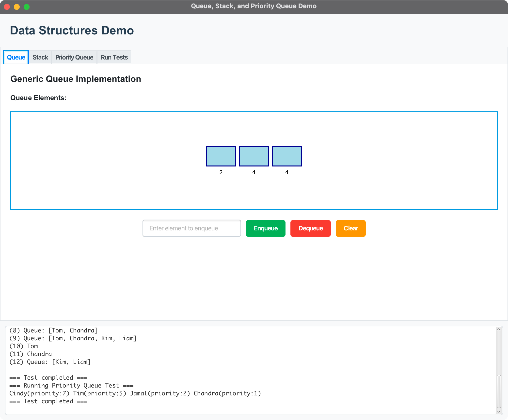
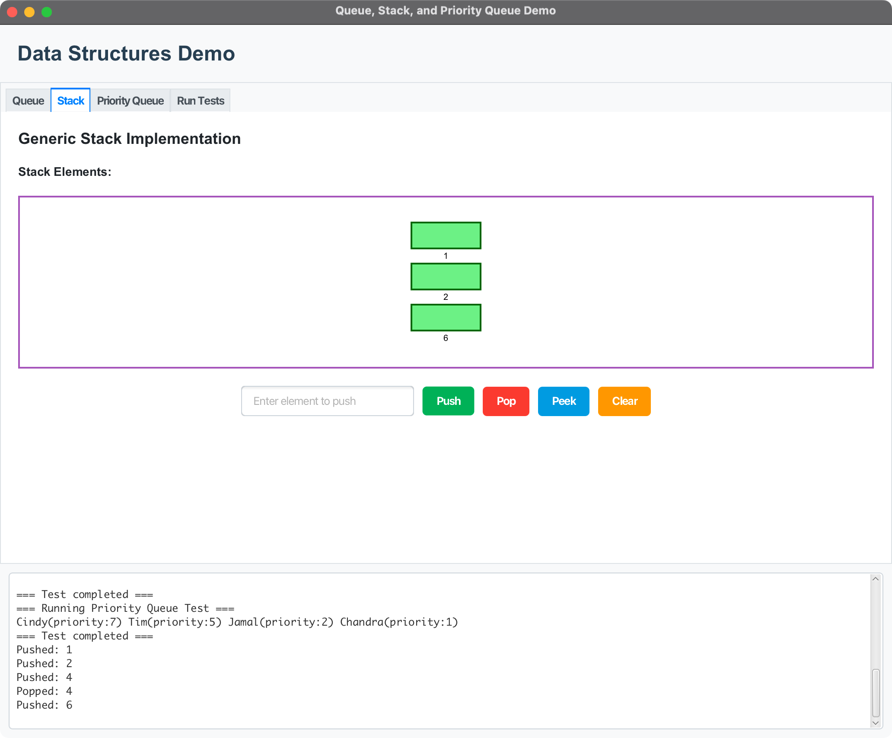
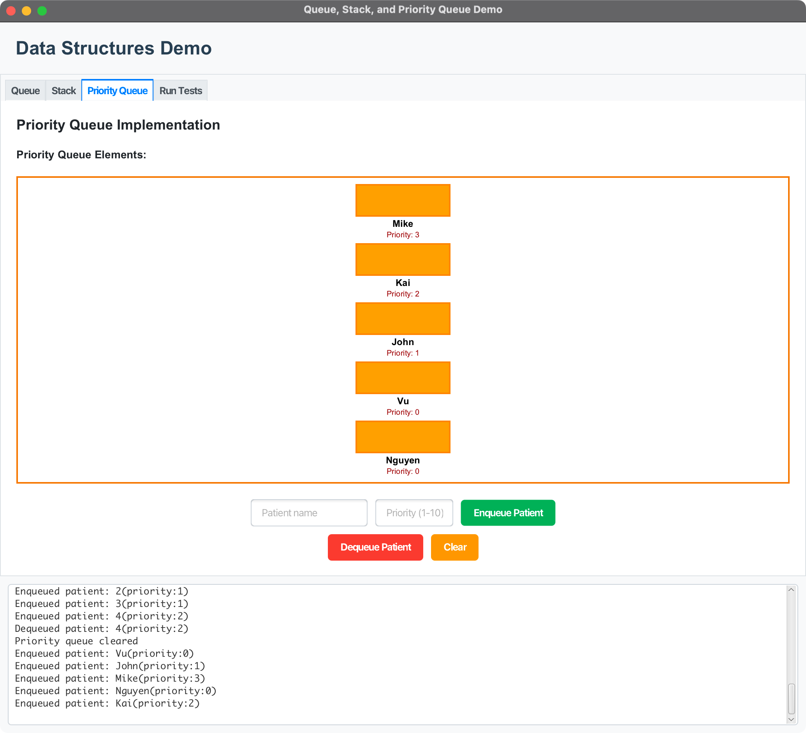

# JavaFX Queue Demo

A JavaFX application that demonstrates Queue, Stack, and Priority Queue data structures with interactive visualizations and predefined tests.

## Overview

This project implements and demonstrates three fundamental data structures:
- **GenericQueue**: A FIFO (First-In-First-Out) queue implementation
- **GenericStack**: A LIFO (Last-In-First-Out) stack implementation  
- **MyPriorityQueue**: A priority queue implementation using a heap

## Features

### Interactive Data Structure Visualization
- **Queue Tab**: Add/remove elements with visual representation
- **Stack Tab**: Push/pop/peek operations with visual stack display
- **Priority Queue Tab**: Add patients with priorities, visualize priority ordering
- **Test Tab**: Run predefined tests from the original source code

### Visual Elements
- Color-coded data structure displays
- Real-time updates as elements are added/removed
- Modern, responsive UI design
- Tabbed interface for easy navigation

### Test Integration
- Original test classes from Liang's textbook
- System output capture and display
- Interactive test execution

## Project Structure

```
10-04-Queue/
├── src/main/java/com/acu/javafx/queue/
│   ├── QueueDemo.java              # Main JavaFX application
│   ├── GenericQueue.java           # Queue implementation
│   ├── GenericStack.java           # Stack implementation
│   ├── Heap.java                   # Heap implementation for priority queue
│   ├── MyPriorityQueue.java        # Priority queue implementation
│   ├── Patient.java                # Patient class for priority queue demo
│   ├── TestStackQueue.java         # Original test class
│   └── TestPriorityQueue.java      # Original test class
├── src/main/resources/
│   └── styles.css                  # CSS styling
├── pom.xml                         # Maven configuration
├── run.sh                          # Unix/Linux/macOS execution script
├── run.bat                         # Windows execution script
├── run_direct.sh                   # Direct Java execution (optional)
└── README.md                       # This file
```

## Data Structure Implementations

### GenericQueue<E>
- **enqueue(E e)**: Adds element to the end of the queue
- **dequeue()**: Removes and returns the first element
- **getSize()**: Returns the number of elements
- **toString()**: Returns string representation

### GenericStack<E>
- **push(E o)**: Adds element to the top of the stack
- **pop()**: Removes and returns the top element
- **peek()**: Returns the top element without removing it
- **isEmpty()**: Checks if stack is empty
- **getSize()**: Returns the number of elements

### MyPriorityQueue<E>
- **enqueue(E newObject)**: Adds element to priority queue
- **dequeue()**: Removes and returns highest priority element
- **getSize()**: Returns the number of elements
- Uses Heap<E> for internal implementation

## Requirements

### Development Environment
- **Java**: OpenJDK 24 or later
- **Maven**: 3.9.x or later
- **JavaFX**: 21 (included in Maven dependencies)

### Cross-Platform Support
- **macOS**: Intel (x86_64) and Apple Silicon (ARM64)
- **Windows**: x86_64 and ARM64
- **Linux**: x86_64 and ARM64

## Building and Running

### Prerequisites
1. Install Java 24 or later
2. Install Maven 3.9.x or later

### Using Maven (Recommended)

#### Unix/Linux/macOS
```bash
./run.sh
```

#### Windows
```cmd
run.bat
```

#### Manual Maven Commands
```bash
# Clean and compile
mvn clean compile

# Run the application
mvn javafx:run

# Package as executable JAR
mvn clean package
```

### Direct Java Execution (Optional)
```bash
./run_direct.sh
```
*Note: Requires JavaFX SDK to be installed and module path configured*

## Usage

### Queue Operations
1. Navigate to the "Queue" tab
2. Enter text in the input field
3. Click "Enqueue" to add elements
4. Click "Dequeue" to remove elements
5. Click "Clear" to empty the queue

### Stack Operations
1. Navigate to the "Stack" tab
2. Enter text in the input field
3. Click "Push" to add elements to the top
4. Click "Pop" to remove the top element
5. Click "Peek" to view the top element
6. Click "Clear" to empty the stack

### Priority Queue Operations
1. Navigate to the "Priority Queue" tab
2. Enter patient name and priority (1-10)
3. Click "Enqueue Patient" to add patients
4. Click "Dequeue Patient" to remove highest priority patient
5. Click "Clear" to empty the priority queue

### Running Tests
1. Navigate to the "Run Tests" tab
2. Click "Test Stack and Queue" to run the original test
3. Click "Test Priority Queue" to run the priority queue test
4. View output in the text area at the bottom

## Technical Details

### Architecture
- **MVC Pattern**: Separation of UI (View) from data structures (Model)
- **Event-Driven**: JavaFX event handling for user interactions
- **Modular Design**: Each data structure is implemented as a separate class

### Cross-Platform Features
- **Maven Profiles**: Automatic platform detection and dependency management
- **Platform-Specific Classifiers**: JavaFX dependencies for each platform
- **Unified Build Scripts**: Single command execution across platforms

### Performance Considerations
- **Efficient Visual Updates**: Only redraw when data changes
- **Memory Management**: Proper cleanup of temporary objects
- **Responsive UI**: Non-blocking operations with Platform.runLater()


## Screenshots





