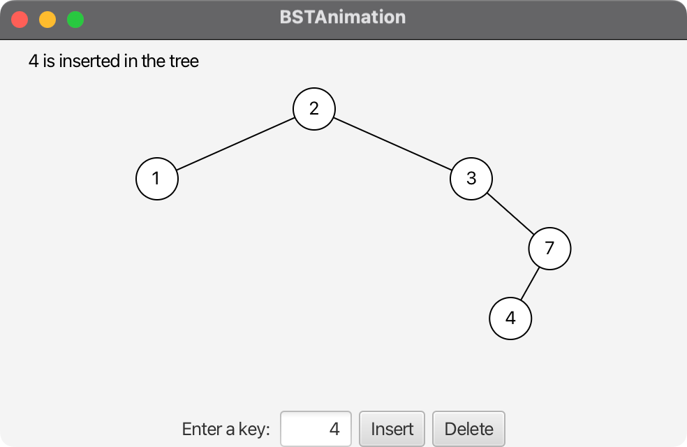

# Binary Search Trees JavaFX Demo

A comprehensive JavaFX application demonstrating Binary Search Trees (BST) with interactive visualization and educational features.

## Overview

This project implements a complete Binary Search Tree data structure with a modern JavaFX interface that allows users to:

- **Insert** elements into the BST
- **Delete** elements from the BST
- **Search** for elements in the BST
- **Visualize** the tree structure in real-time
- **Traverse** the tree in different orders (inorder, preorder, postorder)
- **Use iterators** for enhanced functionality

## Features

### Core BST Implementation
- **Tree Interface**: Generic interface extending `Collection<E>`
- **BST Class**: Complete implementation with all standard operations
- **TreeNode**: Inner static class for tree nodes
- **Iterator Support**: Inorder iterator for enhanced traversal

### JavaFX Visualization
- **Interactive GUI**: Modern JavaFX interface
- **Real-time Updates**: Tree visualization updates immediately
- **Visual Elements**: Circles for nodes, lines for connections
- **Status Messages**: Clear feedback for all operations

### Educational Features
- **Multiple Test Classes**: Demonstrating different aspects of BST
- **Traversal Examples**: Inorder, preorder, and postorder
- **Path Finding**: Visualize paths from root to specific elements
- **Iterator Usage**: Enhanced traversal with foreach loops

## Project Structure

```
src/main/java/com/acu/javafx/binarysearchtrees/
├── Tree.java                    # Generic tree interface
├── BST.java                     # Binary Search Tree implementation
├── BTView.java                  # JavaFX tree visualization
├── BSTAnimation.java            # Main JavaFX application
├── TestBST.java                 # Basic BST operations demo
├── TestBSTDelete.java           # Deletion operations demo
└── TestBSTWithIterator.java     # Iterator usage demo
```

## Technical Specifications

### Development Environment
- **Java Version**: OpenJDK 24
- **JavaFX Version**: 21
- **Maven Version**: 3.9.x or later
- **Target Platform**: Cross-platform (macOS, Windows, Linux)

### Build Configuration
- **Maven**: Automated dependency management
- **Cross-platform**: Works on all major operating systems
- **Modular**: Clean separation of concerns

## Getting Started

### Prerequisites
- Java 24 or higher
- Maven 3.9.x or later
- JavaFX runtime (included in dependencies)

### Installation

1. **Clone the repository**:
   ```bash
   git clone <repository-url>
   cd 11-01-BinarySearchTrees
   ```

2. **Build the project**:
   ```bash
   mvn clean compile
   ```

### Running the Application

#### Option 1: Using Maven (Recommended)
```bash
mvn javafx:run
```

#### Option 2: Using Build Scripts
- **Unix/Linux/macOS**: `./run.sh`
- **Windows**: `run.bat`

#### Option 3: Direct Java Execution
```bash
mvn clean package
java -jar target/binarysearchtrees-1.0.0.jar
```

## Usage

### Main Application (BSTAnimation)
1. **Launch the application** using any of the methods above
2. **Enter a number** in the text field
3. **Click "Insert"** to add the number to the tree
4. **Click "Delete"** to remove the number from the tree
5. **Watch the visualization** update in real-time

### Test Classes
Run individual test classes to see specific BST operations:

```bash
# Basic BST operations
mvn exec:java -Dexec.mainClass="com.acu.javafx.binarysearchtrees.TestBST"

# Deletion operations
mvn exec:java -Dexec.mainClass="com.acu.javafx.binarysearchtrees.TestBSTDelete"

# Iterator usage
mvn exec:java -Dexec.mainClass="com.acu.javafx.binarysearchtrees.TestBSTWithIterator"
```

## BST Operations

### Insertion
- Automatically maintains BST property
- Handles duplicates gracefully
- Updates visualization immediately

### Deletion
- Handles all three cases:
  - Leaf nodes
  - Nodes with one child
  - Nodes with two children
- Maintains tree balance

### Search
- Efficient O(log n) average case
- Returns true/false for element existence

### Traversal
- **Inorder**: Left → Root → Right (sorted order)
- **Preorder**: Root → Left → Right
- **Postorder**: Left → Right → Root

## Architecture

### Design Patterns
- **MVC Pattern**: Separation of data (BST), view (BTView), and control (BSTAnimation)
- **Observer Pattern**: Real-time updates between model and view
- **Iterator Pattern**: Enhanced traversal capabilities

### Key Classes

#### Tree Interface
- Generic interface extending `Collection<E>`
- Defines standard tree operations
- Provides default implementations for Collection methods

#### BST Class
- Complete BST implementation
- Generic type support
- Comparator-based ordering
- Iterator support with inorder traversal

#### BTView Class
- JavaFX Pane extension
- Recursive tree visualization
- Dynamic layout adjustment
- Status message display

#### BSTAnimation Class
- Main JavaFX Application
- Event handling for user interactions
- Integration of model and view

## Cross-Platform Compatibility

### Supported Platforms
- **macOS**: Intel (x86_64) and Apple Silicon (ARM64)
- **Windows**: x86_64 and ARM64
- **Linux**: x86_64 and ARM64

### Build Scripts
- **run.sh**: Unix/Linux/macOS execution
- **run.bat**: Windows batch execution
- **pom.xml**: Maven configuration with platform detection

## Performance Considerations

### Time Complexity
- **Search**: O(log n) average, O(n) worst case
- **Insert**: O(log n) average, O(n) worst case
- **Delete**: O(log n) average, O(n) worst case
- **Traversal**: O(n) for all orders

### Space Complexity
- **Storage**: O(n) for n elements
- **Recursion**: O(h) where h is tree height

## Educational Value

This project serves as an excellent learning resource for:

1. **Data Structures**: Understanding BST concepts
2. **Algorithms**: Tree traversal and manipulation
3. **JavaFX**: Modern GUI development
4. **Software Design**: Clean architecture and patterns
5. **Java Programming**: Generics, iterators, and collections

## Screenshots




