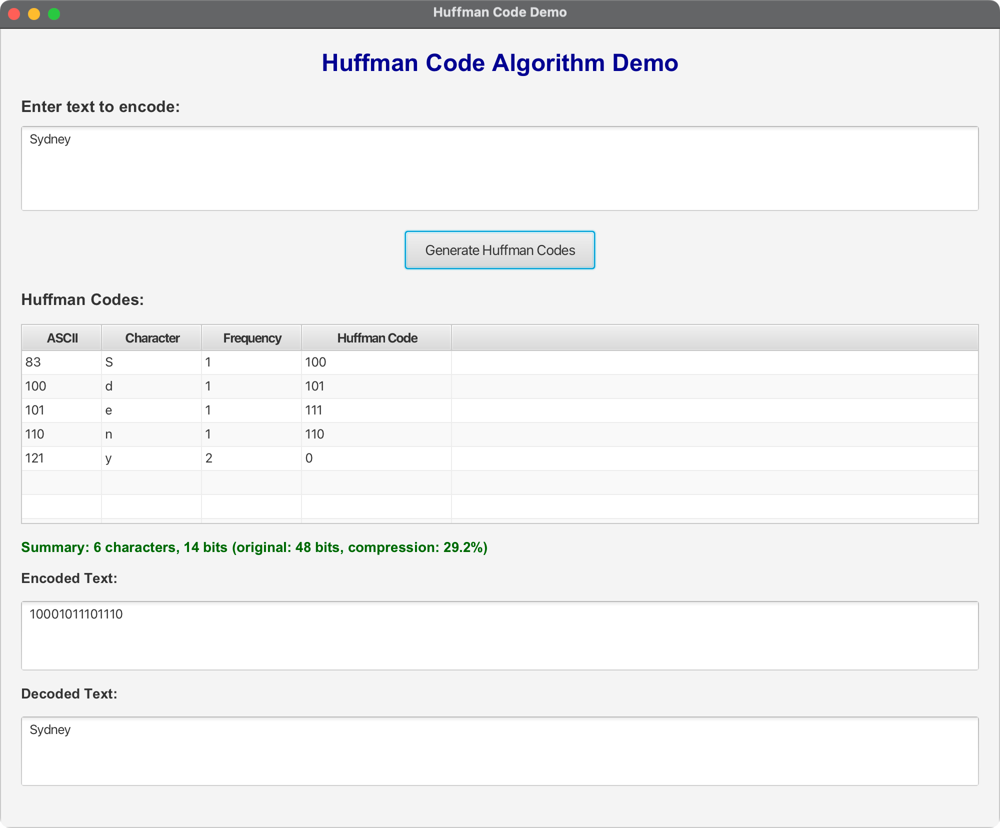

# Huffman Code JavaFX Demo

A JavaFX application that demonstrates the Huffman coding algorithm with an interactive graphical user interface.

## Overview

This project implements the Huffman coding algorithm, a lossless data compression technique that assigns variable-length codes to characters based on their frequency of occurrence. The application provides a modern JavaFX interface for:

- Inputting text for encoding
- Viewing character frequencies and Huffman codes
- Seeing the encoded binary representation
- Decoding the compressed data
- Analyzing compression ratios

## Features

- **Interactive GUI**: Modern JavaFX interface with intuitive controls
- **Real-time Processing**: Instant Huffman code generation
- **Visual Results**: Tabular display of character frequencies and codes
- **Compression Analysis**: Shows compression ratio and bit savings
- **Encode/Decode**: Demonstrates both encoding and decoding processes
- **Cross-platform**: Works on Windows, macOS, and Linux

## Technical Specifications

### Development Environment
- **Java Version**: OpenJDK 24
- **JavaFX Version**: 21
- **Maven Version**: 3.9.x or later
- **Target Platforms**: macOS (Intel/Apple Silicon), Windows (x86_64/ARM64), Linux (x86_64/ARM64)

### Project Structure
```
src/
├── main/
│   ├── java/
│   │   └── com/acu/javafx/huffmancode/
│   │       ├── Launcher.java          # Application entry point
│   │       ├── HuffmanCodeDemo.java   # Main JavaFX application
│   │       ├── HuffmanCode.java       # Core Huffman algorithm
│   │       └── Heap.java              # Heap data structure
│   └── resources/
├── test/
│   └── java/
pom.xml                                # Maven build configuration
run.sh                                 # Unix/Linux/macOS execution script
run.bat                                # Windows execution script
README.md                              # Project documentation
```

## Installation and Setup

### Prerequisites
1. **Java 24 or later** (OpenJDK recommended)
2. **Maven 3.9.x or later**
3. **Git** (for cloning the repository)

### Building the Project

#### Using Maven
```bash
# Clone the repository
git clone <repository-url>
cd 11-02-HuffmanCode

# Build the project
mvn clean compile

# Run the application
mvn javafx:run
```

#### Using Build Scripts

**On Unix/Linux/macOS:**
```bash
chmod +x run.sh
./run.sh
```

**On Windows:**
```cmd
run.bat
```

### Creating Executable JAR
```bash
mvn clean package
java -jar target/huffmancode-1.0.0.jar
```

## Usage

1. **Launch the Application**: Run the application using one of the methods above
2. **Enter Text**: Type or paste text into the input area
3. **Generate Codes**: Click "Generate Huffman Codes" button
4. **View Results**: 
   - Character frequencies and Huffman codes in the table
   - Encoded binary representation
   - Decoded text (verification)
   - Compression statistics

## Algorithm Implementation

### Core Components

1. **Character Frequency Analysis**: Counts occurrences of each character
2. **Huffman Tree Construction**: Builds optimal binary tree using min-heap
3. **Code Generation**: Traverses tree to assign binary codes
4. **Encoding/Decoding**: Converts text to/from binary representation

### Key Classes

- **`HuffmanCode`**: Core algorithm implementation
- **`Heap<T>`**: Generic min-heap data structure
- **`HuffmanCodeDemo`**: JavaFX application interface
- **`Tree`**: Huffman tree node structure

## Example Usage

### Input Text
```
Hello World! This is a test of the Huffman coding algorithm.
```

### Sample Output
| ASCII | Character | Frequency | Huffman Code |
|-------|-----------|-----------|--------------|
| 32    | (space)   | 8         | 00           |
| 97    | a         | 2         | 0100         |
| 101   | e         | 2         | 0101         |
| 102   | f         | 1         | 01100        |
| 103   | g         | 1         | 01101        |
| 104   | h         | 2         | 0111         |
| 105   | i         | 2         | 1000         |
| 108   | l         | 2         | 1001         |
| 109   | m         | 1         | 10100        |
| 110   | n         | 1         | 10101        |
| 111   | o         | 3         | 1011         |
| 114   | r         | 1         | 11000        |
| 115   | s         | 2         | 1101         |
| 116   | t         | 3         | 1110         |
| 119   | w         | 1         | 11110        |
| 33    | !         | 1         | 11111        |

## Performance Characteristics

- **Time Complexity**: O(n log n) for tree construction
- **Space Complexity**: O(n) for storing character frequencies and codes
- **Compression Efficiency**: Typically 20-50% reduction for text data


### Debug Mode
```bash
mvn javafx:run -Djavafx.debug=true
```

## Screenshots




