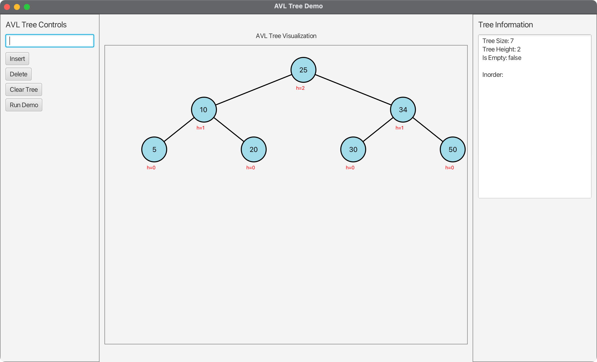

Objectives

- To know what an AVL tree is (§26.1).
- To understand how to rebalance a tree using the LL rotation, LR rotation, RR rotation, and RL rotation (§26.2).
- To know how to design the AVLTree class (§26.3).
- To insert elements into an AVL tree (§26.4).
- To implement node rebalancing (§26.5).
- To delete elements from an AVL tree (§26.6).
- To implement the AVLTree class (§26.7).
- To test the AVLTree class (§26.8).
- To analyze the complexity of search, insert, and delete operations in AVL trees (§26.9).

Lecture 12.1 focuses on **AVL Trees**, a type of self-balancing binary search tree designed to maintain efficiency in search, insertion, and deletion operations.

The primary **objectives** of this lecture include:
*   Understanding what an AVL tree is.
*   Learning how to rebalance an AVL tree using various rotation types (LL, LR, RR, RL).
*   Designing and implementing the `AVLTree` class, including handling insertions and deletions with rebalancing.
*   Analyzing the time complexity of AVL tree operations.

### Why AVL Trees?
As discussed in Lecture 11, the efficiency of operations (search, insertion, deletion) in a standard binary search tree (BST) is dependent on the **height of the tree**. In the worst-case scenario, an unbalanced BST can have a height of O(n) (where 'n' is the number of elements), leading to O(n) time complexity for these operations. While a perfectly balanced binary tree offers a height of O(log n), maintaining such balance is computationally costly. AVL trees provide a **compromise** by maintaining a "well-balanced" tree where the heights of the two subtrees for every node differ by **no more than 0 or 1**. This property ensures that the maximum height of an AVL tree remains O(log n).

### What is an AVL Tree?
An AVL tree is a self-balancing binary search tree where, for every node, the **balance factor** (the height of its right subtree minus the height of its left subtree) is always **-1, 0, or 1**. A node is considered:
*   **Balanced** if its balance factor is -1, 0, or 1.
*   **Left-heavy** if its balance factor is -1.
*   **Right-heavy** if its balance factor is +1.

### Core Operations and Rebalancing
The process of inserting or deleting an element in an AVL tree is initially the same as in a regular binary search tree. However, the key difference is that the tree **may need to be rebalanced** after an insertion or deletion operation to maintain the AVL property. This rebalancing process is called a **rotation**.

There are four primary types of rotations to correct imbalances:

1.  **LL Rotation (Left-Left Imbalance)**: This occurs when a node `A` has a balance factor of -2 and its left child `B` has a balance factor of -1 or 0. This imbalance is fixed by a **single right rotation at node `A`**.
2.  **RR Rotation (Right-Right Imbalance)**: This occurs when a node `A` has a balance factor of +2 and its right child `B` has a balance factor of +1 or 0. This imbalance is fixed by a **single left rotation at node `A`**.
3.  **LR Rotation (Left-Right Imbalance)**: This occurs when a node `A` has a balance factor of -2 and its left child `B` has a balance factor of +1. If `B`'s right child is `C`, this imbalance requires a **double rotation**: first, a single left rotation at `B`, and then a single right rotation at `A`.
4.  **RL Rotation (Right-Left Imbalance)**: This occurs when a node `A` has a balance factor of +2 and its right child `B` has a balance factor of -1. If `B`'s left child is `C`, this imbalance also requires a **double rotation**: first, a single right rotation at `B`, and then a single left rotation at `A`.

### Time Complexity
Because AVL trees maintain their balance, the height of the tree remains logarithmic (O(log n)). Therefore, the time complexity for search, insertion, and deletion operations in an AVL tree is also **O(log n)**. This is a significant improvement over the worst-case O(n) complexity of an unbalanced binary search tree.

### Class Design
An `AVLTree` class can be designed to **extend the `BST` class** (from Lecture 11), inheriting its basic tree operations and then adding the rebalancing logic.

Sample code 

- https://liveexample.pearsoncmg.com/dsanimation/AVLTree.html
- https://liveexample.pearsoncmg.com/html/AVLTree.html
- https://liveexample.pearsoncmg.com/html/TestAVLTree.html

## Screenshots

