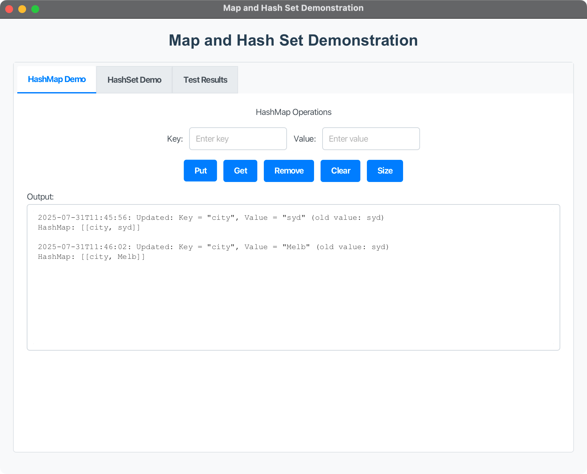
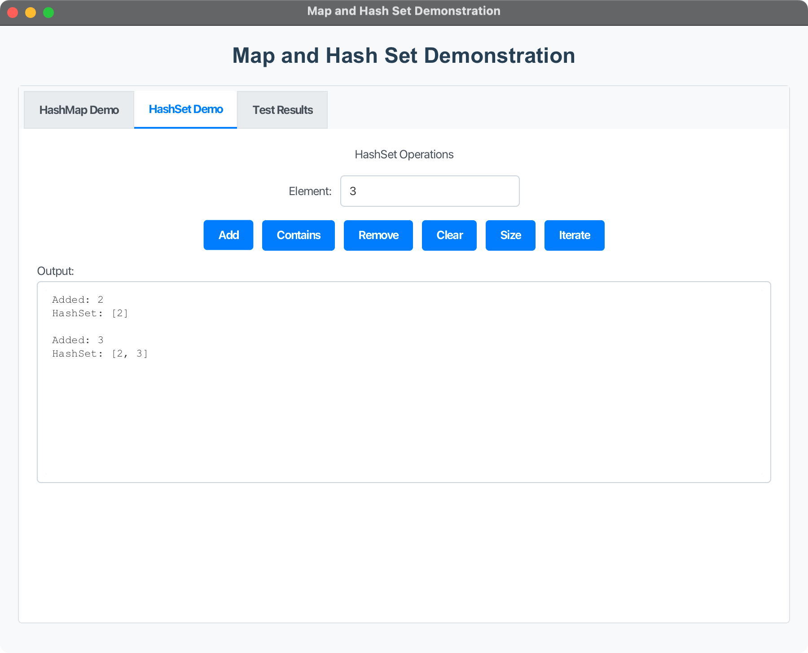
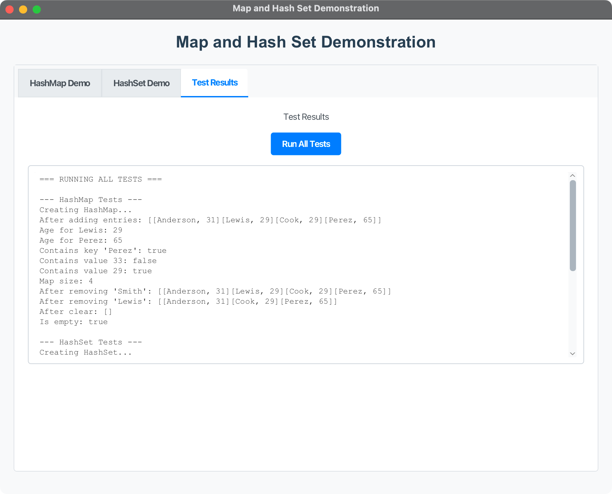

# Map and Hash Set Demonstration

A JavaFX application that demonstrates the implementation and usage of Map and Hash Set data structures using hashing techniques.

## Overview

This project provides a comprehensive demonstration of:
- **MyMap Interface**: A generic map interface with key-value pair operations
- **MyHashMap Implementation**: A hash table-based map implementation using separate chaining
- **MySet Interface**: A generic set interface for unique element collections
- **MyHashSet Implementation**: A hash table-based set implementation
- **Interactive JavaFX GUI**: A modern user interface for testing and demonstrating the data structures

## Features

### Data Structure Implementations
- **HashMap**: O(1) average case for insert, delete, and search operations
- **HashSet**: Efficient set operations with duplicate prevention
- **Separate Chaining**: Collision resolution using linked lists
- **Dynamic Resizing**: Automatic rehashing when load factor threshold is exceeded
- **Generic Types**: Support for any object types as keys and values

### JavaFX Application Features
- **Interactive GUI**: Modern, responsive user interface
- **Tabbed Interface**: Separate tabs for HashMap, HashSet, and test results
- **Real-time Operations**: Add, remove, search, and clear operations
- **Visual Feedback**: Immediate display of operation results
- **Comprehensive Testing**: Automated test suite demonstrating all functionality

## Technical Specifications

### Development Environment
- **Java Version**: OpenJDK 24
- **JavaFX Version**: 21
- **Maven Version**: 3.9.x or later
- **Target Platforms**: macOS (Intel/ARM64), Windows (x86_64/ARM64), Linux (x86_64/ARM64)

### Architecture
- **Package Structure**: `com.acu.javafx.maphash`
- **Build System**: Maven with cross-platform support
- **UI Framework**: JavaFX with modern CSS styling
- **Data Structures**: Custom implementations with standard Java Collections API compatibility

## Project Structure

```
12-03-MapHash/
├── src/
│   ├── main/
│   │   ├── java/com/acu/javafx/maphash/
│   │   │   ├── MyMap.java              # Map interface
│   │   │   ├── MyHashMap.java          # HashMap implementation
│   │   │   ├── MySet.java              # Set interface
│   │   │   ├── MyHashSet.java          # HashSet implementation
│   │   │   ├── TestMyHashMap.java      # HashMap test class
│   │   │   ├── TestMyHashSet.java      # HashSet test class
│   │   │   └── MapHashDemo.java        # Main JavaFX application
│   │   └── resources/
│   │       └── styles.css              # CSS styling
│   └── test/
│       └── java/                       # Unit tests (if any)
├── docs/
│   ├── concepts.md                     # Main concepts and design decisions
│   └── architecture.md                 # Detailed architecture documentation
├── pom.xml                            # Maven configuration
├── run.sh                             # Unix/Linux/macOS run script
├── run.bat                            # Windows run script
└── README.md                          # This file
```

## Getting Started

### Prerequisites
- Java 24 or later (OpenJDK recommended)
- Maven 3.9.x or later
- Git (for cloning)

### Installation

1. **Clone the repository**:
   ```bash
   git clone <repository-url>
   cd 12-03-MapHash
   ```

2. **Build the project**:
   ```bash
   mvn clean compile
   ```

### Running the Application

#### Option 1: Using Maven (Recommended)
```bash
mvn javafx:run
```

#### Option 2: Using Platform Scripts
- **Unix/Linux/macOS**: `./run.sh`
- **Windows**: `run.bat`

#### Option 3: Direct Java Execution
```bash
mvn clean package
java -jar target/maphash-1.0.0.jar
```

## Usage

### JavaFX Application

The application provides three main tabs:

#### 1. HashMap Demo Tab
- **Input Fields**: Key and Value text fields
- **Operations**: Put, Get, Remove, Clear, Size
- **Features**: Real-time map state display, operation feedback

#### 2. HashSet Demo Tab
- **Input Field**: Element text field
- **Operations**: Add, Contains, Remove, Clear, Size, Iterate
- **Features**: Set state display, iteration demonstration

#### 3. Test Results Tab
- **Automated Tests**: Comprehensive test suite
- **Test Coverage**: All major operations and edge cases
- **Output**: Detailed test results and performance metrics

### Programmatic Usage

```java
// HashMap Example
MyMap<String, Integer> map = new MyHashMap<>();
map.put("Alice", 25);
map.put("Bob", 30);
System.out.println("Alice's age: " + map.get("Alice"));

// HashSet Example
MyHashSet<String> set = new MyHashSet<>();
set.add("Apple");
set.add("Banana");
System.out.println("Contains Apple: " + set.contains("Apple"));
```

## Implementation Details

### Hashing Strategy
- **Hash Function**: Uses object's `hashCode()` with supplemental hashing
- **Collision Resolution**: Separate chaining with linked lists
- **Load Factor**: Default 0.75 with automatic rehashing
- **Capacity**: Powers of 2 for efficient bitwise operations

### Performance Characteristics
- **Average Case**: O(1) for insert, delete, and search
- **Worst Case**: O(n) when all elements hash to same bucket
- **Space Complexity**: O(n) for n elements
- **Rehashing**: O(n) when load factor threshold is exceeded

### Key Features
- **Generic Implementation**: Type-safe with compile-time checking
- **Standard API Compliance**: Implements standard Java interfaces
- **Memory Efficient**: Automatic cleanup and resizing
- **Thread Safety**: Not thread-safe (use external synchronization if needed)

## Testing

### Automated Tests
The application includes comprehensive test suites:
- **Unit Tests**: Individual method testing
- **Integration Tests**: End-to-end functionality testing
- **Performance Tests**: Load factor and rehashing validation

### Manual Testing
Use the JavaFX interface to:
- Test edge cases (null values, empty strings)
- Verify collision handling
- Monitor performance under various loads
- Validate iterator behavior

## Cross-Platform Support

### Supported Platforms
- **macOS**: Intel (x86_64) and Apple Silicon (ARM64)
- **Windows**: x86_64 and ARM64
- **Linux**: x86_64 and ARM64

### Platform-Specific Features
- **Automatic Platform Detection**: Maven profiles for different architectures
- **Native Library Loading**: Proper JavaFX runtime distribution
- **Build Scripts**: Platform-specific execution scripts

## Troubleshooting

### Common Issues

#### 1. JavaFX Module Not Found
```bash
# Solution: Ensure JavaFX modules are included
mvn clean compile
mvn javafx:run
```

#### 2. Maven Build Failures
```bash
# Solution: Update Maven and Java versions
mvn -version
java -version
```

#### 3. Platform-Specific Issues
- **macOS**: Ensure Xcode command line tools are installed
- **Windows**: Verify PATH environment variables
- **Linux**: Install required system dependencies

### Debug Mode
```bash
# Enable debug output
mvn javafx:run -Djavafx.debug=true
```


## Screenshots

  