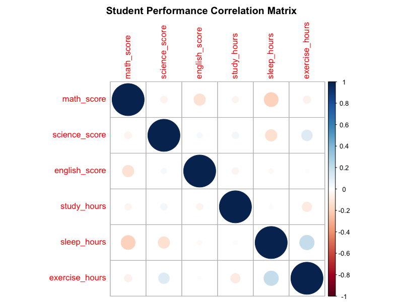
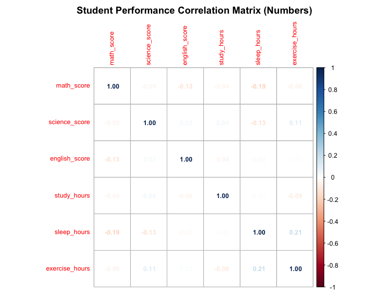
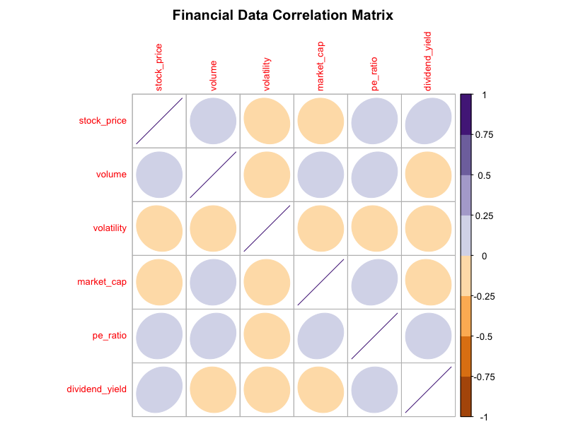
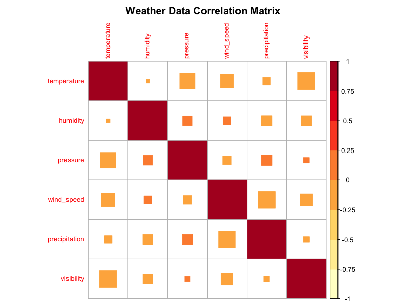
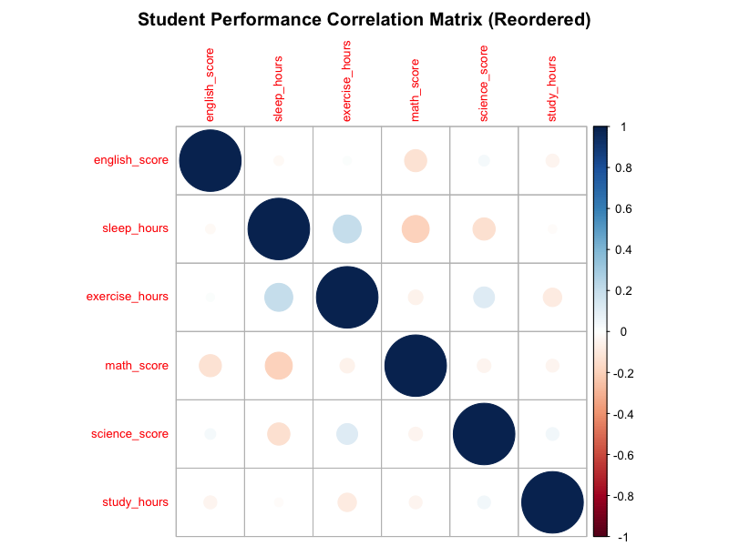
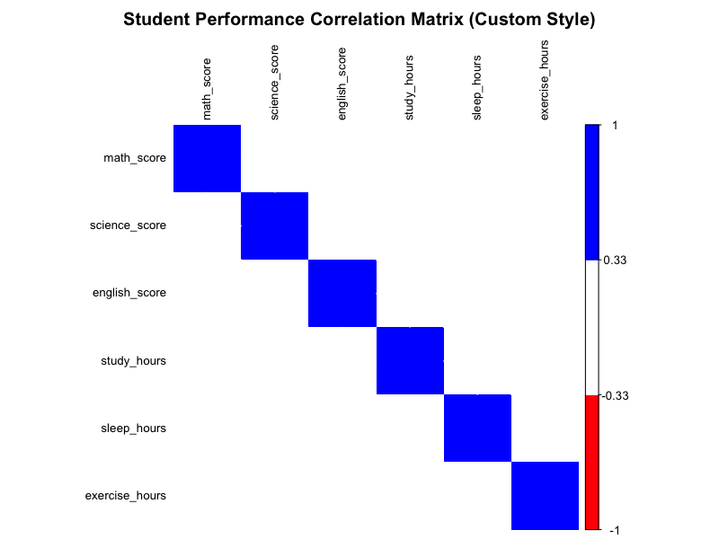

# corrplot Examples

## Overview
This directory contains comprehensive examples of corrplot, R's powerful package for visualizing correlation matrices. The examples demonstrate various visualization methods and techniques using simple, generated sample data.


## Contents
- `corrplot.R` - Main R script with all examples
- `corrplot.md` - Detailed documentation and explanations
- `images/` - Directory containing generated plot images
- `README.md` - This file

## What is corrplot?
corrplot is an R package that provides a visual exploratory tool on correlation matrices. It supports automatic variable reordering to help detect hidden patterns among variables and is particularly useful for understanding relationships between multiple variables in a dataset.

## Features Demonstrated
The examples cover 10 different correlation visualization methods:

1. **Basic Correlation Plot (Circles)** - Standard circle representation
2. **Correlation Plot with Numbers** - Numerical display of coefficients
3. **Correlation Plot with Color Gradient** - Color-coded matrix
4. **Mixed Correlation Plot** - Upper/lower triangle combinations
5. **Financial Data Correlation (Ellipses)** - Elliptical visualization
6. **Weather Data Correlation (Squares)** - Square tile representation
7. **Reordered Correlation Plot** - Hierarchical clustering reordering
8. **Correlation Plot with Significance Testing** - Statistical significance
9. **Custom Styled Correlation Plot** - Personalized styling
10. **Summary Correlation Plot (Pie Charts)** - Pie chart visualization

## Sample Data
The examples use three simple, generated datasets:
- **Student Performance Data**: 100 students with 6 performance variables
- **Financial Data**: 100 records with 6 market variables
- **Weather Data**: 100 records with 6 climate variables

## Quick Start

### Prerequisites
- R installed on your system
- corrplot package
- RColorBrewer package (for color palettes)

### Installation
```r
install.packages("corrplot")
install.packages("RColorBrewer")
```

### Running the Examples
```r
# Load the libraries
library(corrplot)
library(RColorBrewer)

# Run the script
source("corrplot.R")
```

### Output
The script generates 10 high-quality PNG images in the `images/` directory, each demonstrating different corrplot capabilities.

## Key Concepts Covered
- **Correlation Matrix**: Understanding correlation coefficients between variables
- **Visualization Methods**: Different ways to represent correlations (circles, numbers, colors, etc.)
- **Color Schemes**: Using color palettes to represent correlation strength and direction
- **Reordering**: Automatic arrangement of variables to reveal patterns
- **Significance Testing**: Statistical testing of correlation significance
- **Customization**: Personalizing appearance and styling

## Visualization Methods Explained

### 1. Circle Method
- **Appearance**: Circles of varying sizes
- **Size**: Represents correlation strength
- **Color**: Represents correlation direction
- **Use Case**: General purpose, easy to interpret

### 2. Number Method
- **Appearance**: Numerical correlation coefficients
- **Precision**: Exact correlation values
- **Readability**: Easy to read precise values
- **Use Case**: Detailed analysis, reporting

### 3. Color Method
- **Appearance**: Color-coded squares
- **Intensity**: Represents correlation strength
- **Hue**: Represents correlation direction
- **Use Case**: Quick pattern recognition

### 4. Ellipse Method
- **Appearance**: Elliptical shapes
- **Shape**: Indicates correlation strength and direction
- **Aesthetics**: More visually appealing
- **Use Case**: Presentations, publications

### 5. Square Method
- **Appearance**: Square tiles
- **Size**: Represents correlation strength
- **Color**: Represents correlation direction
- **Use Case**: Compact visualization

### 6. Shade Method
- **Appearance**: Shaded squares
- **Intensity**: Represents correlation strength
- **Direction**: Represents correlation direction
- **Use Case**: Custom styling

### 7. Pie Method
- **Appearance**: Pie chart segments
- **Segments**: Represent correlation strength
- **Uniqueness**: Distinctive visual style
- **Use Case**: Creative presentations

## Best Practices
- Choose appropriate visualization method based on your audience and purpose
- Use meaningful color schemes that are intuitive and accessible
- Consider reordering variables to reveal hidden patterns
- Include statistical significance testing when appropriate
- Ensure text labels are readable and informative
- Combine different methods for comprehensive visualization

## File Structure
```
00-01-corrplot/
├── corrplot.R         # Main R script
├── corrplot.md        # Detailed documentation
├── README.md          # This file
└── images/            # Generated plot images
    ├── 01_basic_correlation.png
    ├── 02_correlation_numbers.png
    ├── 03_correlation_color.png
    ├── 04_mixed_correlation.png
    ├── 05_financial_correlation.png
    ├── 06_weather_correlation.png
    ├── 07_reordered_correlation.png
    ├── 08_confidence_correlation.png
    ├── 09_custom_correlation.png
    └── 10_summary_correlation.png
```

## Learning Path
1. Start with basic correlation plots (circles, numbers)
2. Explore color-based visualizations
3. Learn about different geometric methods (ellipses, squares, pie charts)
4. Understand variable reordering and clustering
5. Master significance testing and advanced features
6. Experiment with custom styling and mixed methods

## Key Functions and Parameters

### Main Function
- `corrplot()`: Primary function for creating correlation plots

### Method Parameters
- `method`: Visualization method ("circle", "number", "color", "ellipse", "square", "shade", "pie")
- `type`: Plot type ("full", "upper", "lower")
- `order`: Variable ordering ("original", "hclust", "alphabet", "FPC", "AOE")
- `col`: Color palette for correlation values
- `tl.cex`: Text label size
- `number.cex`: Number size (when using "number" method)

### Advanced Features
- `p.mat`: P-value matrix for significance testing
- `sig.level`: Significance level threshold
- `add`: Whether to add to existing plot
- `mar`: Plot margins
- `bg`: Background color

# Screenshots 

         
