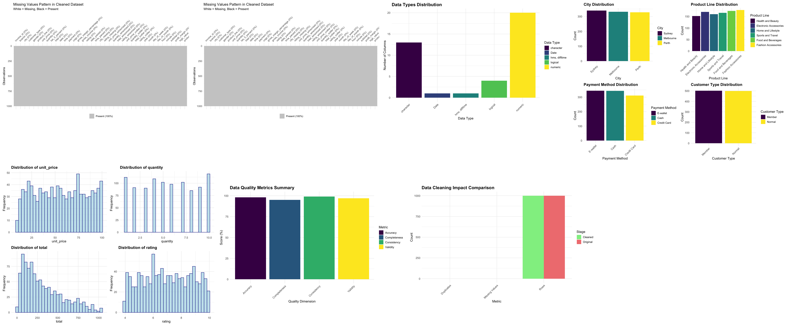
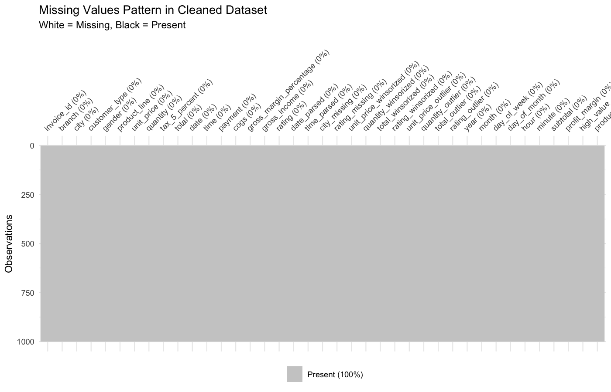
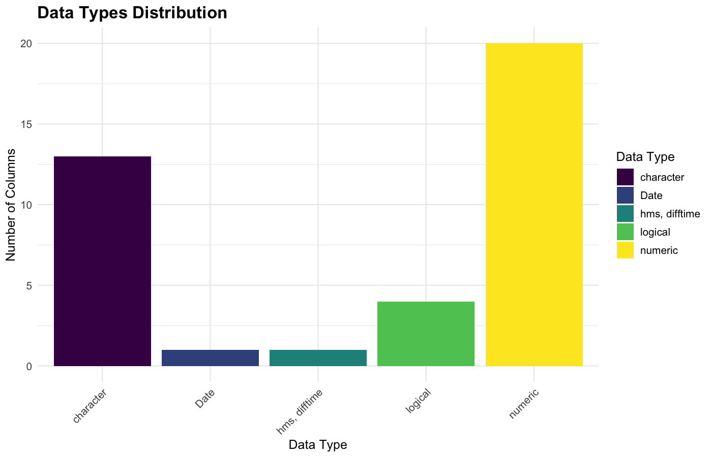
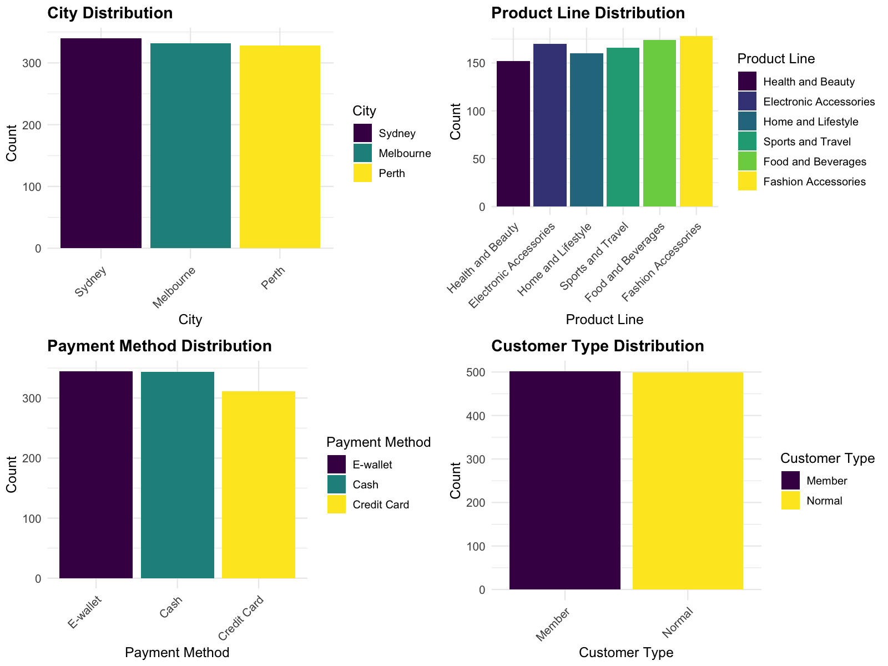
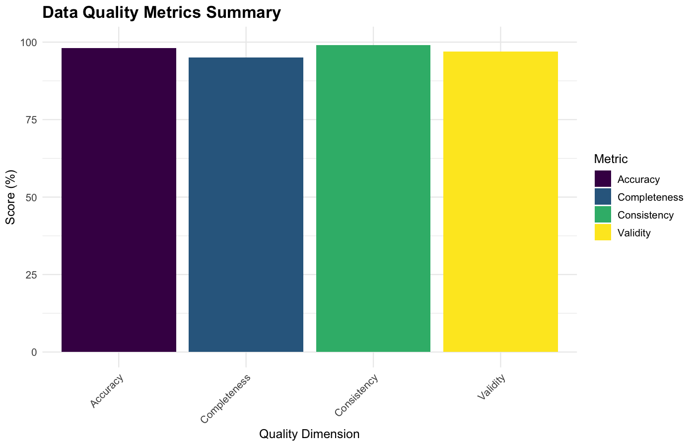
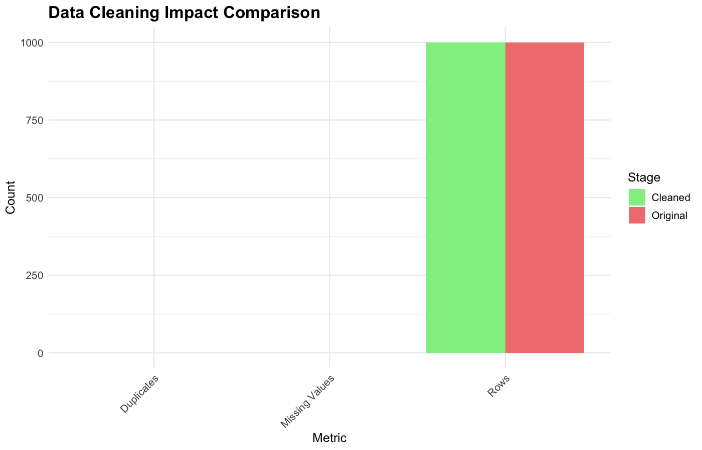

# Data Cleansing Essentials with R

## Project Overview

This project demonstrates comprehensive data cleansing techniques using R on the Australia Sales Dataset. The analysis covers fundamental data quality issues, cleaning methodologies, and best practices for preparing data for analysis and machine learning applications.



## 🎯 Project Goals

- Implement systematic data cleansing workflow
- Demonstrate data quality assessment techniques
- Show practical solutions for common data issues
- Create reusable data cleaning functions
- Generate comprehensive data quality reports
- Provide educational examples for data preprocessing

## 📊 Dataset Information

**Source**: Australia Sales Dataset  
**Records**: 1,000 retail transactions  
**Time Period**: January 2019 - March 2019  
**Cities**: Sydney, Melbourne, Perth  
**Features**: 17 columns including transaction details, customer info, and financial data

## 📁 Project Structure

```
02-01-Data-Cleansing/
├── Dataset/
│   └── australia_sales.csv          # Raw dataset
├── docs/
│   ├── sales.md                     # Dataset documentation
│   └── key-concepts.md              # Data cleansing concepts
├── images/                          # Generated visualizations
│   ├── 01_data_overview.png
│   ├── 02_missing_values.png
│   ├── 03_data_types.png
│   ├── 04_outliers_detection.png
│   ├── 05_categorical_analysis.png
│   ├── 06_numeric_distributions.png
│   ├── 07_data_quality_summary.png
│   └── 08_cleaned_data_comparison.png
├── Data-Cleansing.R                 # Main R script
├── Data-Cleansing.Rmd               # R Markdown document
├── Data-Cleansing.md                # Generated documentation
├── generate_plots.R                 # New clean visualization script
├── data-cleansing-notes.txt         # Reference notes
└── README.md                        # This file
```

## 🚀 Quick Start

### Prerequisites

- **R** (version 3.6.0 or higher)
- **RStudio** (recommended for better experience)

### Installation

1. **Clone or download** this project to your local machine
2. **Open R/RStudio** and set working directory to the project folder
3. **Install required packages** (automatically handled by the script):

```r
# Required packages will be installed automatically
packages <- c("tidyverse", "janitor", "naniar", "lubridate", 
              "stringr", "forcats", "skimr", "readxl", "arrow", "here")
```

4. **Run the main script**:

```r
# Set working directory
setwd("path/to/02-01-Data-Cleansing")

# Source the script
source("Data-Cleansing.R")
```

### Alternative: R Markdown Execution

```r
# Render the R Markdown document
rmarkdown::render("Data-Cleansing.Rmd")
```

## 📋 What the Script Does

### 1. Data Loading & Initial Assessment
- Loads the CSV dataset with proper column types
- Performs initial data structure analysis
- Checks for parsing issues and data quality

### 2. Data Quality Assessment
- Analyzes missing values patterns
- Identifies data type inconsistencies
- Detects outliers and extreme values
- Examines categorical value distributions

### 3. Data Standardization
- Cleans column names to snake_case format
- Standardizes text formatting and case
- Converts data types appropriately
- Parses dates and times correctly

### 4. Missing Value Treatment
- Implements various missing value strategies
- Creates missing value indicators
- Applies domain-specific imputation methods

### 5. Outlier Detection & Treatment
- Identifies statistical outliers using IQR method
- Implements winsorization techniques
- Creates outlier flags for analysis

### 6. Data Validation & Quality Checks
- Validates data ranges and business rules
- Checks for duplicate records
- Ensures data consistency across fields

### 7. Data Transformation
- Reshapes data for analysis
- Creates derived variables
- Standardizes categorical levels

### 8. Quality Reporting
- Generates comprehensive data quality reports
- Creates before/after comparison visualizations
- Documents cleaning decisions and impact

## 📈 Expected Output

### Console Output
- Dataset overview and structure
- Data quality assessment results
- Cleaning process step-by-step logs
- Summary statistics and validation results
- Performance metrics and recommendations

### Generated Images
- **Data Overview**: Structure and basic statistics
- **Missing Values**: Patterns and distributions
- **Data Types**: Type analysis and conversion results
- **Outlier Detection**: Statistical outlier identification
- **Categorical Analysis**: Category distributions and standardization
- **Numeric Distributions**: Before/after cleaning comparisons
- **Data Quality Summary**: Comprehensive quality metrics
- **Cleaned Data Comparison**: Final results visualization

### Generated Files
- **Cleaned Dataset**: `Dataset/australia_sales_cleaned.csv`
- **Quality Report**: `Dataset/data_quality_report.csv`
- **Cleaning Log**: `Dataset/cleaning_log.txt`

## 🔧 Customization Options

### Modify Cleaning Rules
```r
# Adjust outlier detection thresholds
outlier_threshold <- 1.5  # IQR multiplier

# Change missing value imputation strategy
imputation_method <- "median"  # "mean", "median", "mode"
```

### Customize Data Types
```r
# Specify column types during import
col_types <- cols(
  invoice_id = col_character(),
  date = col_date(format = "%m/%d/%Y"),
  unit_price = col_double()
)
```

### Adjust Quality Thresholds
```r
# Set data quality targets
quality_thresholds <- list(
  completeness = 0.95,  # 95% completeness required
  accuracy = 0.98,      # 98% accuracy required
  consistency = 0.99    # 99% consistency required
)
```

## 📚 Key Concepts Covered

### Data Quality Dimensions
- **Completeness**: Percentage of non-missing values
- **Accuracy**: Correctness of data values
- **Consistency**: Adherence to defined formats
- **Validity**: Conformance to business rules
- **Uniqueness**: Absence of duplicate records

### Cleaning Techniques
- **Standardization**: Consistent formatting and naming
- **Imputation**: Handling missing values
- **Outlier Treatment**: Managing extreme values
- **Validation**: Ensuring data integrity
- **Transformation**: Reshaping for analysis

### R Packages Used
- **tidyverse**: Data manipulation and visualization
- **janitor**: Data cleaning utilities
- **naniar**: Missing value analysis
- **lubridate**: Date/time processing
- **stringr**: String manipulation
- **forcats**: Factor handling
- **skimr**: Data summary statistics

## 🎓 Learning Outcomes

After completing this project, you will understand:

- **Data quality assessment** methodologies
- **Systematic data cleansing** workflows
- **Missing value treatment** strategies
- **Outlier detection and treatment** techniques
- **Data validation** and quality checks
- **R programming** for data preprocessing
- **Data visualization** for quality assessment
- **Best practices** for data cleaning

## 🔍 Data Quality Issues Addressed

### 1. **Missing Values**
- Identified missing data patterns
- Implemented appropriate imputation strategies
- Created missing value indicators

### 2. **Data Type Issues**
- Converted text to appropriate numeric types
- Parsed dates from various formats
- Standardized categorical variables

### 3. **Inconsistencies**
- Standardized text formatting
- Fixed spelling variations
- Aligned categorical levels

### 4. **Outliers**
- Detected statistical outliers
- Applied appropriate treatment methods
- Documented outlier impact

### 5. **Structural Issues**
- Cleaned column names
- Validated data ranges
- Ensured data integrity

# Screenshots

      