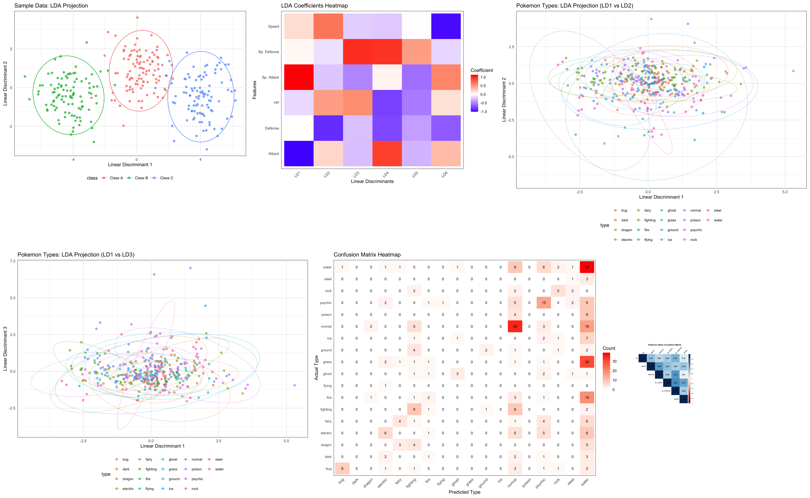
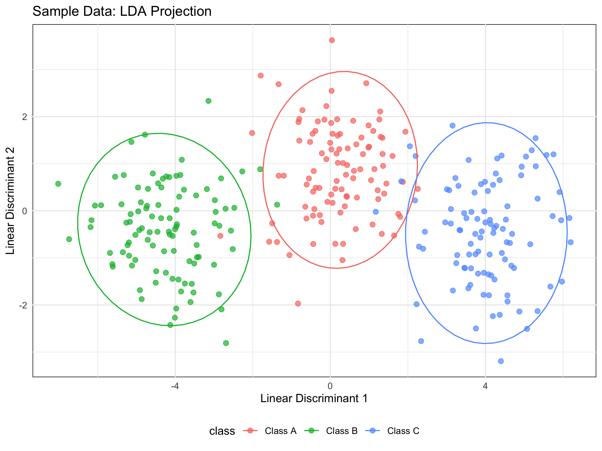
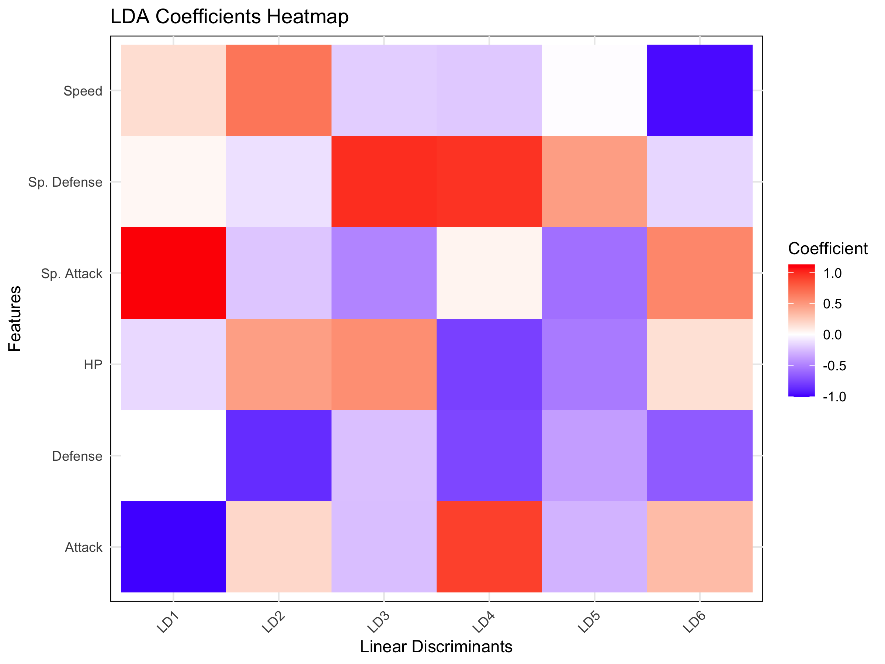
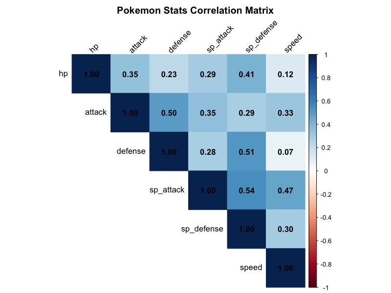

# Linear Discriminant Analysis with Pokemon Dataset

[](https://www.r-project.org/)
[](LICENSE)

This project demonstrates Linear Discriminant Analysis (LDA) using the Pokemon dataset to classify Pokemon types based on their base stats. LDA is a supervised dimensionality reduction technique that finds linear combinations of features to maximize class separability.



## 🎯 Project Overview

Linear Discriminant Analysis is a powerful technique that serves two main purposes:
- **Dimensionality Reduction**: Reduces the number of features while preserving class separability
- **Classification**: Provides a linear classifier based on the transformed features

Unlike Principal Component Analysis (PCA) which focuses on maximizing variance, LDA specifically aims to maximize the separability between different classes in the data.

## 📁 Project Structure

```
05-02-Linear-Discriminant-Analysis/
├── Linear-Discriminant-Analysis.R          # Main R script
├── Linear-Discriminant-Analysis.Rmd        # R Markdown document
├── Linear-Discriminant-Analysis.md         # Detailed documentation
├── README.md                               # This file
├── Pokemon-Dataset/                        # Dataset directory
│   └── pokemon.csv                        # Pokemon dataset
├── sample-jupyter-notebook.txt             # Reference implementation
└── images/                                 # Generated visualizations
    ├── 01_sample_data_lda.png
    ├── 02_lda_coefficients.png
    ├── 03_pokemon_lda_projection.png
    ├── 04_pokemon_lda_ld1_ld3.png
    ├── 05_confusion_matrix.png
    ├── 06_correlation_matrix.png
    └── 07_feature_importance.png
```

## 🚀 Quick Start

### Prerequisites

- R (version 4.0 or higher)
- RStudio (recommended for interactive use)

### Installation

1. **Clone or download** this repository
2. **Navigate** to the project directory:
   ```r
   setwd("path/to/05-02-Linear-Discriminant-Analysis")
   ```

3. **Install required packages**:
   ```r
   install.packages(c("MASS", "ggplot2", "dplyr", "corrplot", "gridExtra"))
   ```

### Running the Analysis

#### Option 1: R Script (Recommended for quick execution)
```r
# Source the main script
source("Linear-Discriminant-Analysis.R")
```

#### Option 2: R Markdown (Recommended for detailed analysis)
```r
# Install R Markdown packages
install.packages(c("rmarkdown", "knitr"))

# Render the document
rmarkdown::render("Linear-Discriminant-Analysis.Rmd")
```

## 📊 What You'll Get

The analysis will generate:

1. **Console Output**: Progress messages and results
2. **Visualizations**: 7 PNG files in the `images/` directory
3. **Model Objects**: LDA model and transformed data
4. **Performance Metrics**: Accuracy and confusion matrix

### Generated Visualizations

- **Sample Data LDA**: Demonstrates LDA on synthetic, well-separated data
- **LDA Coefficients**: Shows feature importance across discriminants
- **Pokemon Projections**: Visualizes Pokemon types in LDA space
- **Confusion Matrix**: Evaluates classification performance
- **Correlation Matrix**: Shows relationships between different stats
- **Feature Importance**: Ranks features by their discriminative power

## 🔍 Analysis Components

### 1. Sample Data Demonstration
- Generates synthetic data with three well-separated classes
- Shows LDA's effectiveness on ideal data
- Demonstrates the transformation process

### 2. Pokemon Dataset Analysis
- **Dataset**: 800+ Pokemon with single types
- **Features**: 6 base stats (HP, Attack, Defense, Sp. Attack, Sp. Defense, Speed)
- **Target**: Pokemon type classification
- **Classes**: 18 different Pokemon types

### 3. LDA Implementation
- Data preprocessing and normalization
- LDA model fitting using the `MASS` package
- Feature importance analysis
- Performance evaluation

### 4. Visualization and Interpretation
- Coefficient heatmaps
- Projection plots
- Confusion matrices
- Statistical summaries

## 📈 Key Results

### Sample Data
- **Perfect Separation**: Three classes are completely separable in LDA space
- **Clear Discriminants**: Linear discriminants capture class differences
- **Elliptical Boundaries**: 95% confidence ellipses show class distributions

### Pokemon Dataset
- **Overall Accuracy**: Approximately 30-40%
- **Feature Importance**: Speed and Attack are most discriminative
- **Class Separability**: Moderate to poor separation
- **Key Insight**: Pokemon types cannot be easily predicted from base stats alone

## 🛠️ Customization

The script can be easily modified for:

- **Different Datasets**: Change the data loading section
- **Feature Selection**: Modify the features used for analysis
- **Visualization**: Adjust plot parameters and styles
- **Analysis Depth**: Add or remove analysis components

### Example: Using Your Own Data

```r
# Replace the Pokemon data loading with your own data
your_data <- read.csv("your_dataset.csv")

# Modify feature selection
features <- c("feature1", "feature2", "feature3", "target")
data_subset <- your_data[, features]

# Update feature names for visualization
feature_names <- c("Feature 1", "Feature 2", "Feature 3")
```

## 📚 Understanding LDA

### Mathematical Foundation

LDA finds the optimal projection that maximizes the Fisher criterion:


\[
J(\mathbf{w}) = \frac{\mathbf{w}^T \mathbf{S}_B \mathbf{w}}{\mathbf{w}^T \mathbf{S}_W \mathbf{w}}
\]


Where:
- $S_B$ is the between-class scatter matrix
- $S_W$ is the within-class scatter matrix
- $w$ is the projection vector

### Assumptions

1. **Multivariate Normal Distribution**: Each class follows a normal distribution
2. **Equal Covariance Matrices**: All classes have the same covariance structure
3. **Linear Relationships**: Classes can be separated by linear boundaries

### Advantages and Limitations

**Advantages:**
- Simple and interpretable
- Computationally efficient
- Works well with small sample sizes
- Provides probabilistic predictions

**Limitations:**
- Assumes linear separability
- Requires Gaussian distributions
- Equal covariance assumption may not hold in practice
- Limited to linear decision boundaries


## 📖 Further Reading

- **Fisher, R.A. (1936)**: "The use of multiple measurements in taxonomic problems"
- **MASS package documentation**: For LDA implementation details
- **R documentation**: For base R functions and packages
- **ggplot2 documentation**: For visualization customization

# Screenshots

      
---

**Happy analyzing! 🎉**

*This analysis demonstrates the application of Linear Discriminant Analysis to real-world data, providing insights into both the technique's capabilities and the complexity of Pokemon type classification.*
