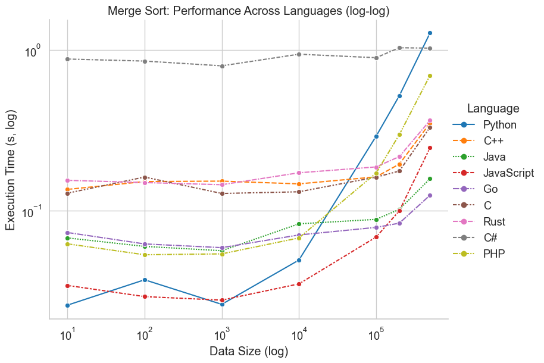

## Quick Start

0. Quick start (clean, analyze, visualize):

Edit `config/number-of-data-points.txt` to set the number of data points to sort, then run:

   ```bash
   make clean ; make analyze; make visualize
   ```

1. Run the all-in-one script to generate data, run comparisons, and update documentation:

   ```bash
   python scripts/run_all.py
   ```

   To run each test multiple times and average the results (e.g., 7 times):

   ```bash
   python scripts/run_all.py --repeat 7
   ```

2. View consolidated results for a specific size (e.g., 100,000):

   ```bash
   cat analysis/consolidated_results_100000.txt
   ```

3. View the performance summary:

   ```bash
   cat docs/PERFORMANCE-SUMMARY-2025.md
   ```

4. View multi-size comparison study:

   ```bash
   cat docs/MULTI_SIZE_PERFORMANCE_STUDY.md
   ```

## Usage

This repository provides scripts to run and compare sorting algorithm implementations across languages.

### Quick Start

Run all tests with default settings:

```bash
python scripts/run_all.py
```

### Additional Options

The main script (`run_all.py`) supports several options:

- `--clean` - Clean all generated datasets and results
- `--clean-results` - Clean only results files
- `--clean-datasets` - Clean only dataset files
- `--generate-only` - Generate datasets but don't run comparisons
- `--sizes SIZE1,SIZE2,...` - Run tests only for specific data sizes (comma-separated)

#### Examples

```bash
# Clean all data and start fresh
python scripts/run_all.py --clean

# Run only for small dataset (faster testing)
python scripts/run_all.py --sizes 5000

# Generate data without running tests
python scripts/run_all.py --generate-only
```

### Data Sizes

The following data sizes are currently configured for testing:
1,000, 10,000, 50,000, 100,000, 250,000, 500,000

Last updated: 05 June 2025

## Requirements

- Python 3.x
- C/C++ compiler (GCC or equivalent)
- Java Development Kit (JDK)
- Node.js
- Go compiler
- Rust compiler (rustc)

## License

This project is licensed under the MIT License - see the [LICENSE.md](LICENSE.md) file for details.

## Key Performance Findings (June 2025)

Our latest multi-size performance comparison study revealed:

- **Fastest Algorithm:** Counting Sort in C achieved 206.8M elements/second with 500K dataset
- **Best General-Purpose Algorithm:** Quick Sort demonstrated excellent performance across all languages
- **Quadratic Impact:** O(n²) algorithms became impractical beyond tiny datasets (N > 10)
- **Language Performance:** Low-level languages (C, C++) significantly outperformed interpreted languages
- **Scaling Characteristics:** Linear algorithms (Counting, Radix) showed the best scaling properties

### Performance Highlights (N = 500K elements)
TODO: Check the performance of Rust.

| Algorithm    | C         | C++       | Go       | JavaScript | Java     | Python   | Rust     |
|--------------|-----------|-----------|----------|------------|----------|----------|----------|
| Counting Sort| **206.8M/s** | 100.4M/s  | 87.2M/s  | 38.1M/s    | 57.3M/s  | `1.7M/s` | 180.2M/s |
| Radix Sort   | **75.4M/s**  | 74.0M/s   | 40.2M/s  | 13.4M/s    | 19.6M/s  | `0.7M/s` | 72.8M/s  |
| Quick Sort   | 16.5M/s   | **18.1M/s**   | 17.7M/s  | 10.6M/s    | 15.6M/s  | `0.7M/s` | 17.9M/s  |
| Merge Sort   | `7.8M/s`    | **19.9M/s**   | 10.4M/s  | 4.6M/s     | 9.7M/s   | 0.5M/s   | 18.2M/s  |

*Numbers represent elements sorted per second. **Bold = highest (best)**, `Monospace = lowest (worst)`. Higher is better/faster.*

For comprehensive results and analysis, see [docs/PERFORMANCE-SUMMARY-2025.md](docs/PERFORMANCE-SUMMARY-2025.md) and [docs/MULTI_SIZE_PERFORMANCE_STUDY.md](docs/MULTI_SIZE_PERFORMANCE_STUDY.md).

## Documentation

For more detailed information on how to run the implementations and tests, see [docs/HOWTO.md](docs/HOWTO.md).

For information on how to contribute to the project, see [docs/CONTRIBUTING.md](docs/CONTRIBUTING.md).

For a complete list of documentation, see [docs/README.md](docs/README.md).

For guidance on which sorting algorithm to use for different scenarios, see [docs/ALGORITHM-PERFORMANCE-GUIDE.md](docs/ALGORITHM-PERFORMANCE-GUIDE.md).

For a comprehensive comparison of all sorting algorithms, see [docs/SORTING-ALGORITHMS-COMPARISON.md](docs/SORTING-ALGORITHMS-COMPARISON.md).

## Visualization of Results

The following log-log plot visualizes the execution time vs. data size for each algorithm and language:



To generate this plot, use the provided Python script:

```bash
make visualize
```

This will generate a log-log plot of execution time vs. data size for each algorithm and language, saved as `images/*.png`.
